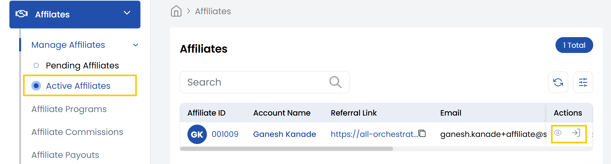
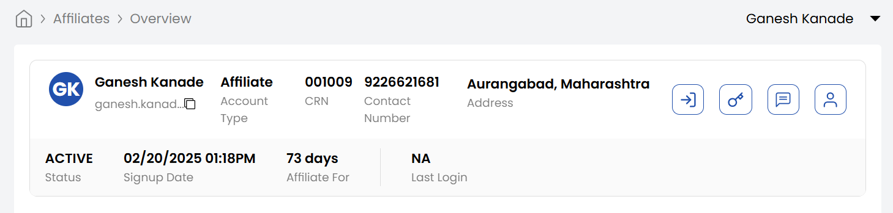

## Accessing Affiliate

**Stack Console** provides a streamlined way to access and manage affiliate accounts. This guide covers how to view list of affiliates, log in to affiliate dashboards, and access detailed information on affiliate.

- From the left-hand menu, navigate to the **Affiliate** section.  
- Under **Manage Affiliates** section, click **Active Affiliates** to display a full list of registered affiliates.

### Logging Into a Affiliate Dashboard

- Locate the desired affiliate in the list.  
- Click the **Login** icon on the right side of their entry to access their dashboard directly.  

### Accessing Detailed Affiliate Information

- Click the **Affiliate ID** in the list or click the **View** icon next to the affiliate's entry.
- Upon selecting a affiliate, the **Affiliate Details** page will appear. This page provides a comprehensive overview of the affiliate's information, including:

    - **Name**: The name associated with the affiliate.
    - **Email Address**: The primary email address associated with the affiliate.
    - **Account Type**: Type of the account as Affiliate.
    - **CRN Number**: The unique Customer Reference Number assigned to the affiliate.
    - **Contact Number**: The affiliate's registered phone number.
    - **Address**: The affiliate's physical or mailing address.
    - **Sign-up Date**: The date when the affiliate was first registered in the system.
    - **Affiliate For**: Displays how many days the affiliate has been active since their sign-up date.
    - **Status**: Displays Active or Inactive status of the account.
    - **Last Login**: Displays the most recent date and time the affiliate logged into their account.  

### Conclusion

With these steps, you can efficiently manage affiliate's accounts in Stack Console, whether for troubleshooting, audits, or support. For advanced affiliate management features, refer to the Stack Console Documentation or contact support.
