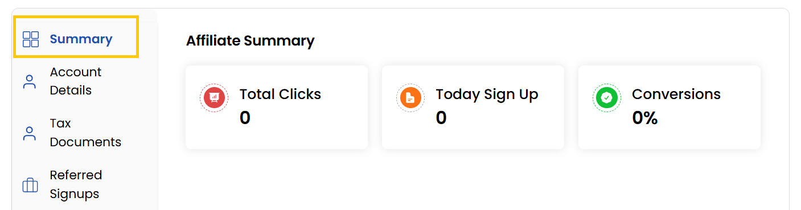

## Summary Tab

The **Summary** Tab provides a high-level overview of the affiliate's information. This tab helps affiliates and admins instantly assess how well the referral link is performing.

    - **Total Clicks**: The number of times the affiliate’s referral link was clicked.
    - **Today Sign Up**: How many users signed up through the referral link on the current day
    - **Conversions**: The conversion rate, i.e., the percentage of link clicks that turned into sign-ups or sales.

