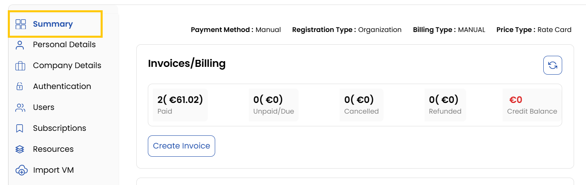
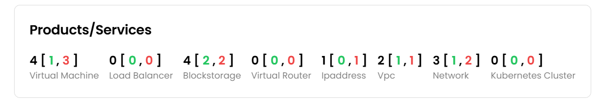
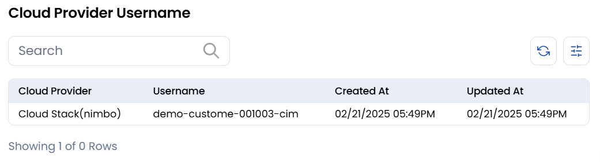

## Summary Tab

The Summary Tab provides a high-level overview of the partner's key information, focusing on services, billing, and infrastructure.

### Invoice/Billing Summary

- Displays an overview of billing details such as total invoices, unpaid amounts, and pending charges. Alternatively, you can create an invoice here.

### Products & Services

- Lists the client's active services, including:
    - **Virtual Machines (VMs)**: Information on deployed VMs.
    - **Load Balancers**: Details on configured load balancing services.
    - **Lockstore**: Secure storage information.
    - **Virtual Routers**: Details on network configurations.
    - **IP Addresses**: Displays assigned IPs.
    - **VPC**: Information about the client's isolated private cloud environment..
    - **Networks**: Configured segments within the network for resource connectivity.
    - **Kubernetes Clusters**: Lists the client's Kubernetes environments.

### Cloud Provider Username

- Shows cloud account details for integrations with providers like Cloudstack, VM Ware, etc.
- Useful for managing and identifying cloud-linked accounts.

### Conclusion
The Summary Tab offers a consolidated view of a client's essential account details, enabling quick access to financial, service, and cloud integration information.