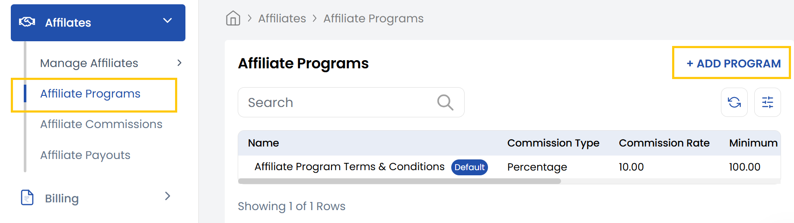
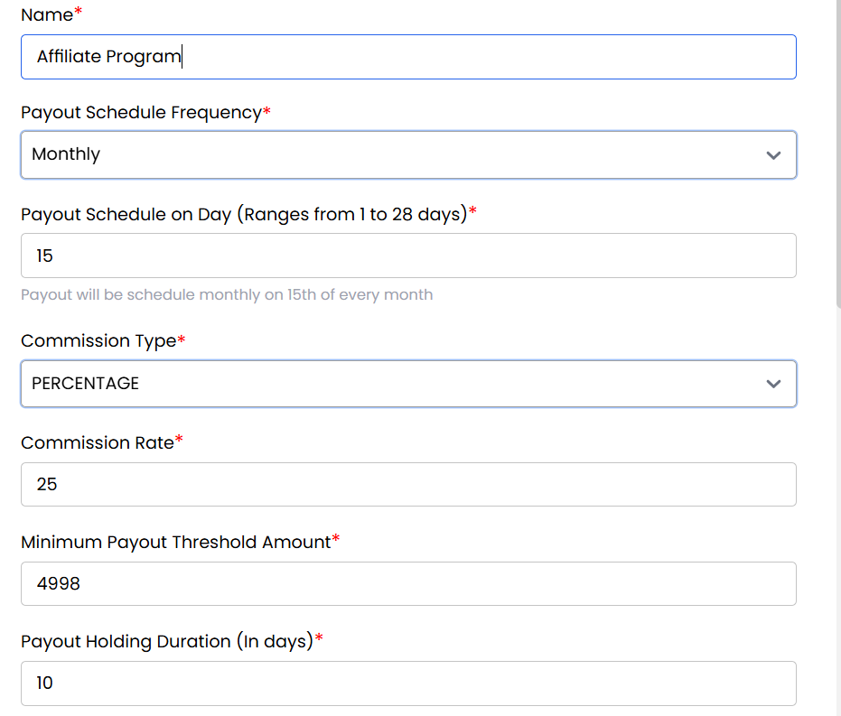

## Affiliate Programs

The **Affiliate Programs** tab is where admins create and configure different affiliate commission plans. These programs define how much commission an affiliate earns, whether it's a percentage of the sale or a fixed amount per referral.

- From left-hand side of the page under **Affiliates** section, click on **Affiliate Programs** to view list of affiliate programs. 
- To create a new affiliate program click on **Add Program**.

- Fill the Affiliate Program form to create affiliate program. 

- **Name**: Enter the name of the affiliate program (e.g., "20% Monthly Plan").
- **Payout Schedule Frequency**: Choose how often payouts will be made (e.g., Weekly, Monthly).
- **Payout Schedule on Day (1–28)**: Set the specific day of the month when payouts occur.
- **Commission Type**: Select whether commission is a fixed amount or a percentage of sales.
- **Commission Rate**: Enter the exact commission amount or percentage.
- **Minimum Payout Threshold Amount**: Minimum commission balance required to trigger a payout.
- **Payout Holding Duration (In days)**: Days to hold commission before making it eligible for payout.
- **Terms and Conditions**: Add any legal or operational terms for this affiliate program.
- **Status**: Set the program as Active or Inactive.
- **Commissions on the Renewal of Services**: Enable if commissions should apply to renewals.
- **Mark as Default**: Make this the default program for new affiliates.
Click on **Submit** your affiliate program will be created.

