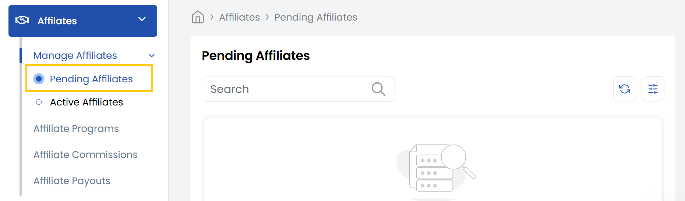
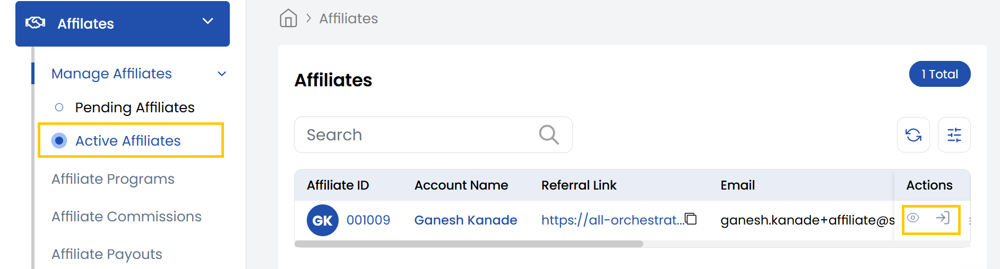

## Manage Affiliates

Affiliates are individuals or partners who promote your platform or products in exchange for a commission on referred sales or actions.

- From left-hand side of the page under **Affiliates** section, click on **Manage Affiliates** to view list of affiliates.

### Pending Affiliates

The affiliate is created but not yet approved, so commissions are not tracked or earned.

### Active Affiliates

The affiliate is approved and live, with referral tracking and commission earning enabled.

----------

### Conclusion
The Affiliates section provides complete management of your partner network, from pending approvals to active referral tracking. For affiliate account inquiries, contact support.