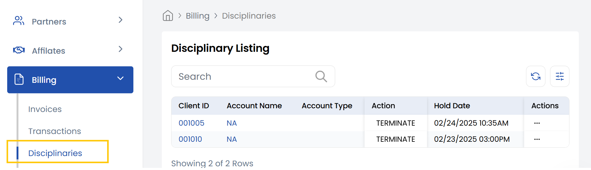

## Disciplinary 

The **Disciplinary Listing** tab displays a list of all accounts that have been placed under disciplinary actions such as account holds or restrictions like **Termination**. 

From the three dots besides the listing, you can perform following actions on the disciplinary action taken:

- **Revoke:** Immediately removes the disciplinary action from the client’s account.
- **Schedule Revoke:** Sets a future date and time to automatically lift the disciplinary action.

