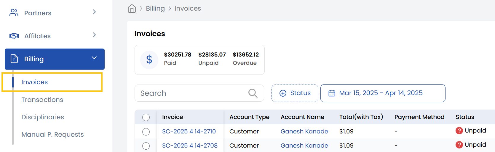

## Invoices

The **Invoices** tab gives you a comprehensive overview of all billing invoices associated with your account. 
- You can view and filter invoices by status, including paid, unpaid, and overpaid. 
- Each invoice includes important details such as the invoice number, issue date, total amount, payment status, and associated payment method. 
- It also allows you to download invoices individually, making it easier to keep records for financial reporting or internal audits.

