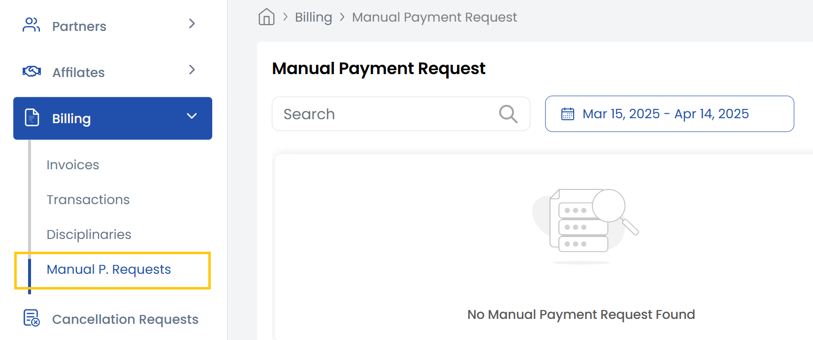

The **Manual Payment Requests** tab allows users to manually request a payment or billing correction when needed. This is especially helpful in cases where automated billing doesn’t apply or when special handling is required. Users can submit requests by specifying the amount, reason, and supporting documents. 

- The tab also displays the status of each request (pending, approved, or declined), along with a history of all submissions, helping you manage exceptions in the billing process efficiently.

