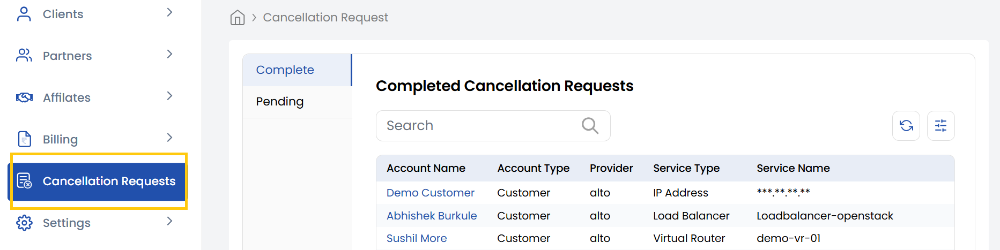

## Cancellation Requests

The **Cancellation Requests** tab handles termination requests. Ensures cancellation processes are organized.

- **Pending Requests** - Unprocessed cancellation requests.
- **Completed Requests** - Approved and processed cancellations.

### Conclusion
The Cancellation Requests tab provides centralized management of termination processes, maintaining clear visibility of request statuses at every stage.