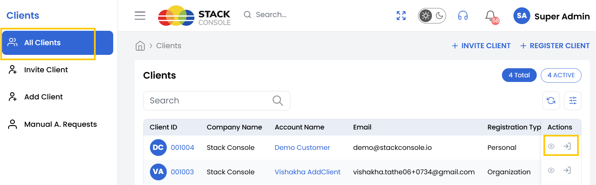
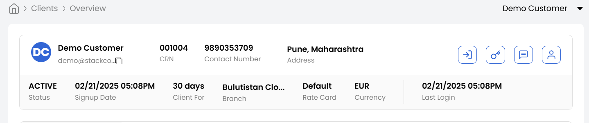

## Accessing Client

**Stack Console** provides a streamlined way to access and manage client accounts. This guide covers how to view client lists, log in to client dashboards, and access detailed client information.

- From the left-hand menu, navigate to the **Clients** section.  
- Click **All Clients** to display a full list of registered clients.

### Logging Into a Client Dashboard

- Locate the desired client in the list.  
- Click the **Login** icon  on the right side of their entry to access their dashboard directly.  

### Accessing Detailed Client Information

- Click the **Client ID** in the list or click the **View** icon next to the client’s entry.
- Upon selecting a client, the **Client Details** page will appear. This page provides a comprehensive overview of the client’s information, including:

    - **Name**: The name associated with the client.
    - **Email Address**: The primary email address associated with the client.
    - **CRN Number**: The unique Client Reference Number assigned to the client.
    - **Contact Number**: The client’s registered phone number.
    - **Address**: The client's physical or mailing address.
    - **Sign-up Date**: The date when the client was first registered in the system.
    - **Client Duration**: Displays how many days the client has been active since their sign-up date.
    - **Branch**: The specific branch or office the client is associated with.
    - **Rate Card**: The pricing structure or plan linked to the client.
    - **Currency**: The currency in which transactions for this client are processed.
    - **Last Login**: Displays the most recent date and time the client logged into their account.  

 

### Conclusion

With these steps, you can efficiently manage client accounts in Stack Console, whether for troubleshooting, audits, or support. For advanced client management features, refer to the Stack Console Documentation or contact support.  