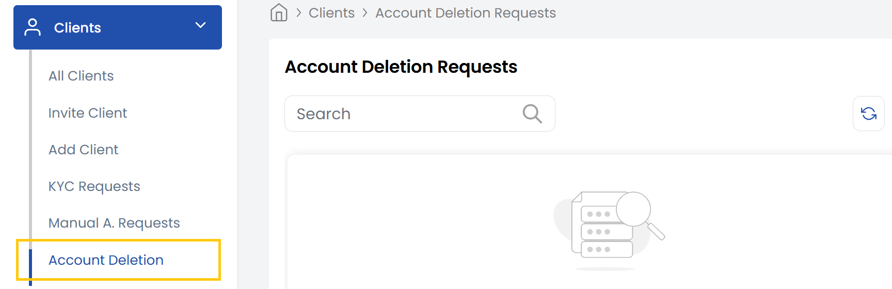

## Managing Account Deletion Requests

The **Account Deletion Requests** in a stack console involves carefully reviewing and processing user-initiated account removal requests. It provides options to either approve or deny the deletion based on validations.

### Conclusion

The system logs every deletion request action to ensure traceability. Approved deletions result in account data removal, while denied requests can trigger follow-up actions depending on your configuration.
