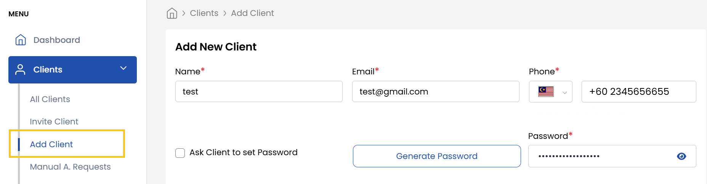
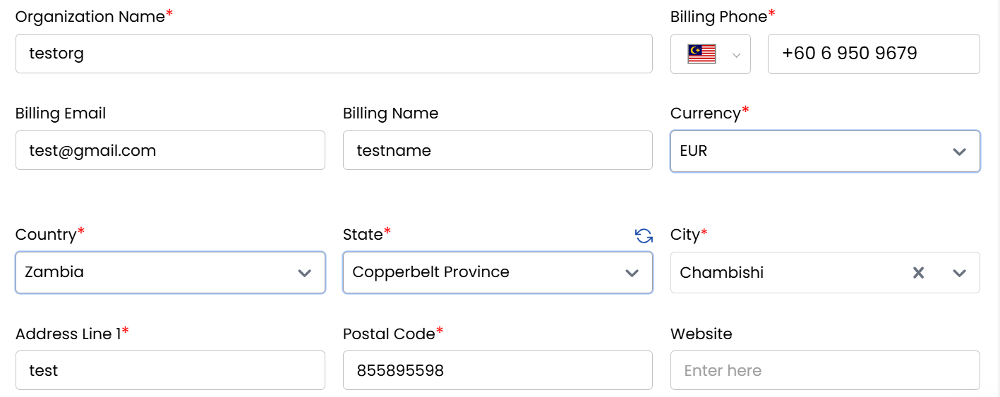

# Add Client

The **Add Client** tab in **Stack Console** allows administrators to register new clients with customizable billing, payment, and account settings. Follow these steps to add a client manually.

### Accessing the Client Registration Form

- From the left-hand menu, expand the **Clients** drop-down.  
- Click **Add Client** to open the registration form.

### Setting Up Billing Details

- Enter the Name, Email and Password. You can ask Client to Set Password on first login or generate a secure password automatically.
- Setup billing address and details. You can register the client as either:

  - **Organization**: For businesses/companies (requires tax ID, company address)  
  - **Individual**: For personal accounts  

- Choose one of the following payment options:

    - **Prepaid**: Client pays upfront for services  
    - **Postpaid**: Client is billed after service usage  
    - **Manual**: Payments processed offline (e.g., invoices, bank transfers)  

- Set the status of the client based on their current standing:

    - **Active**: Grants full access to services  
    - **Inactive**: Temporarily disables the account  
    - **Closed**: Permanently deactivates the account  

- Navigate to the **Price Card** section. Select the client's **Rate Card** to define service pricing  
- Review all entered details and click **Register** to submit  
- After successfull registration, the client details are saved and an automated email (if enabled) is sent with account credentials.

### Conclusion
Adding a client through the Stack Console ensures a structured and traceable onboarding process. Each step from entering client information to setting billing options and helps streamline client management and supports efficient service delivery.