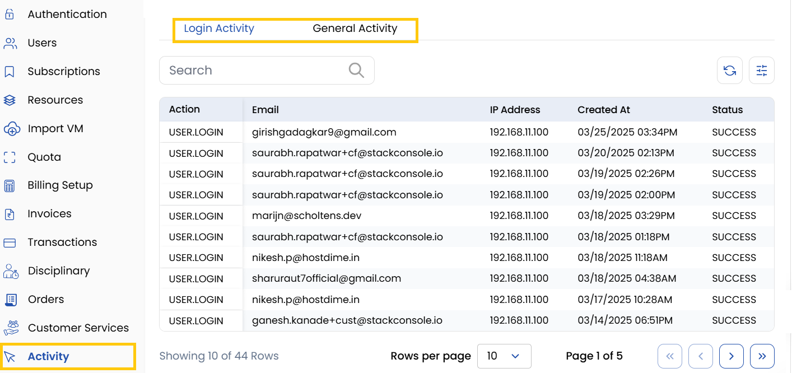

# Activity

The **Activity Tab** logs all actions performed by the client, providing full visibility into client activities.

- **Login Activity** - Tracks all sign-in attempts and authentication events.
- **General Activity** - Records changes made to services, settings, or resource usage.

## Conclusion

The Activity tab serves as a comprehensive audit log, enabling administrators to monitor and review all client interactions with the system. This visibility helps maintain security and accountability across all platform activities.