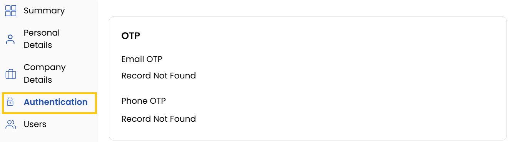
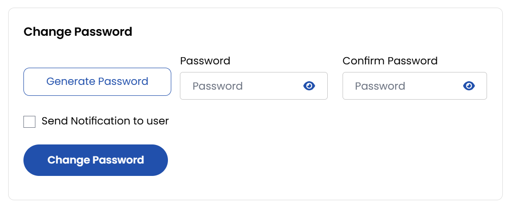
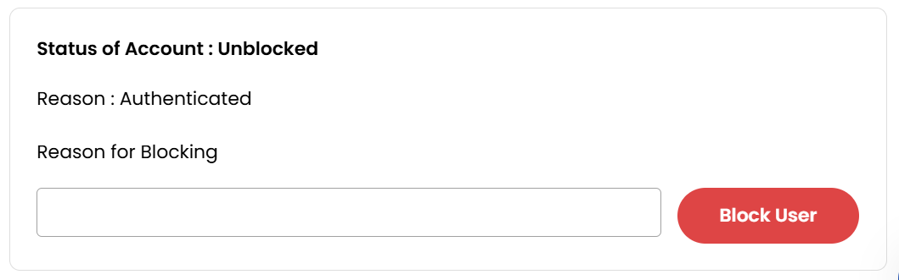

## Authentication

The **Authentication** tab manages account security with OTP verification records, password changes, and account blocking features. It provides centralized control for maintaining system access integrity.

- Displays OTP records for email and phone verification.

### Change Your Password

To maintain account security, it's essential to change your password periodically.

- Navigate to the **Profile** section from the left-hand menu.
- Select **Authentication**, then click on **Change Password**.
- Enter your **Current Password**, then enter and confirm your **New Password**.
- Click **Change Password** to save changes.

### Block/Unlock Account

- **To Block an account**: Provide a reason and click **Block User**.
- **To Unlock an account**: Click **Unblock User**.

### Conclusion

The Authentication tab provides essential security controls, enabling safe management of verification systems, credentials, and account access. Regular use of these features helps maintain your system's security posture.

:::tip
**See also:**  
- **[Account Deletion Requests](../Account%20Deletion%20Requests.md)**
:::