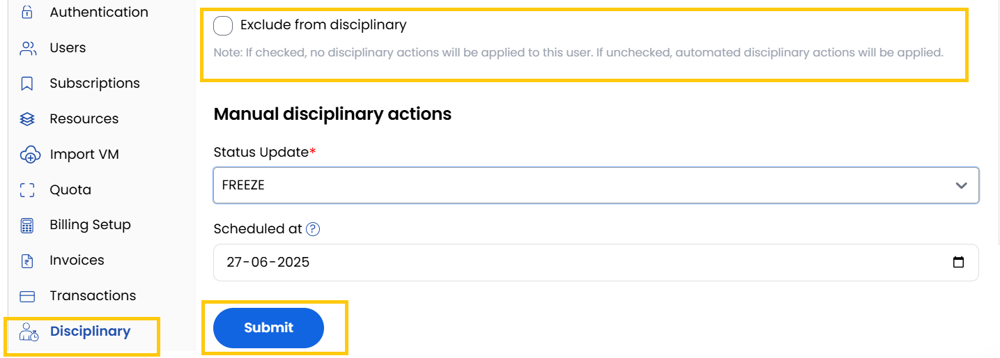
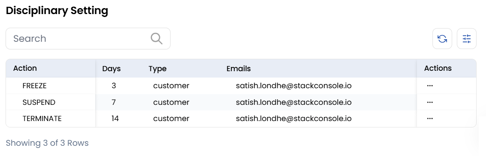

# Disciplinary

The **Disciplinary Tab** in Stack Console is used to manage client restrictions and compliance, ensuring adherence to platform rules.

- By enabling the **Exclude from Disciplinary** option it prevents automated penalties for the client
- **Note**: If checked, no disciplinary actions will be applied to this user. If unchecked, automated disciplinary actions will be applied.
- The **Manual Disciplinary Actions** allows you to manually change the client's status to:

    - **Active**: Full access with regular billing.
    - **Free**: Full access without charges.
    - **Suspended**: Limited or no access due to violations.
    - **Terminated**: Permanent closure with revoked services.

- You can schedule a time at which it automates disciplinary actions to be triggered on specified dates or conditions. 

- Displays a comprehensive record of past disciplinary actions applied to the client. Provides transparency and easy reference for client compliance management

## Conclusion
The Disciplinary tab provides granular control over client access and restrictions, combining automated enforcement with manual oversight capabilities.

:::tip
**See also:**  
- **[Disciplinary Actions](../../Settings/Billing%20Setup/Disciplinary%20Action.md)**
:::