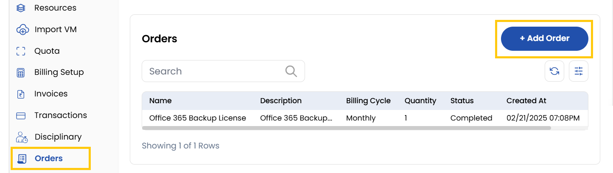
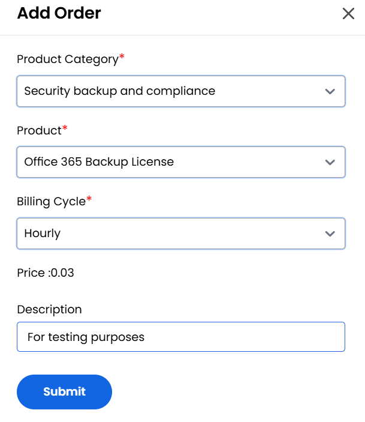

## Orders

The **Orders** tab is designed to help clients manage their purchases effectively. This section allows users to view all past and current invoices linked to their account. Orders are commonly used to add additional products, licenses, tools, essential add-ons, and more.

- To add an order, click on **Add Order** button.

- Choose a **Product Category** and the **Product** you want to buy from the list.
- Choose the desired **Billing Cycle** for your order. You can choose either Hourly or Monthly or Yearly and add **Description**.
- Click on **Submit** to create the order successfully.

### Conclusion
The Orders tab centralizes purchase management for additional services with flexible billing options.