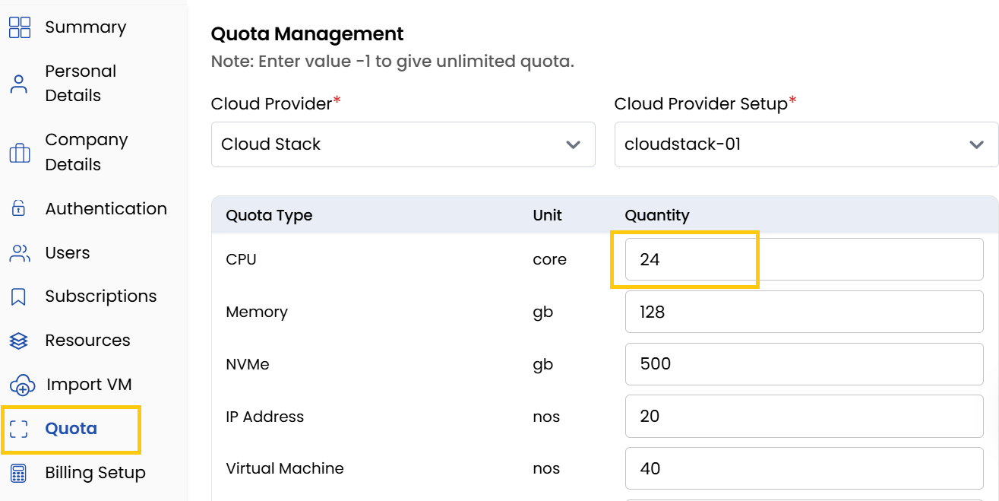

# Quota

The **Quota Tab** manages resource limits for clients. Ensures clients operate within designated resource limits. You can also increase or decrease these quotas by adjusting the quantity limits.

:::note
Enter value **-1** to set unlimited quota.
:::

## Conclusion
The Quota system provides controlled resource allocation, enabling administrators to maintain balanced usage across client accounts while allowing flexible adjustments as needed.

:::tip
**See also:**  
- **[Resources](./Resources.md)**
- **[Subscriptions](./Subscriptions.md)**
- **[Resource Quota Request](../../Settings/Quota/Resource%20Quota%20Request.md)**
:::