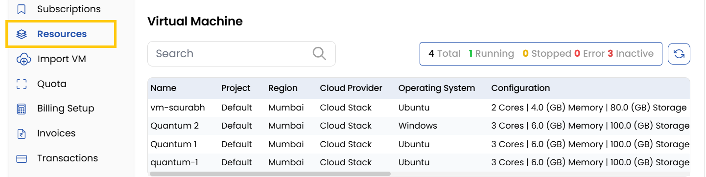

# Resources

The **Resources Tab** tracks all client-related resources. Ensures all resources are monitored in one place.

- **Virtual Machine** - Lists deployed VMs.
- **Block Storage** - Lists available volumes and block storage.
- **IP Access** - Displays active IP addresses.
- **Kubernetes Clusters** - Tracks Kubernetes deployments.
- **Network** - Lists network configurations associated with services.

## Conclusion
The Resources tab provides centralized visibility of all client infrastructure components, enabling efficient monitoring and management of deployed services.

:::tip
**See also:**  
- **[Orders](./Orders.md)**
- **[Customer Service](./Customer%20Services.md)**
:::