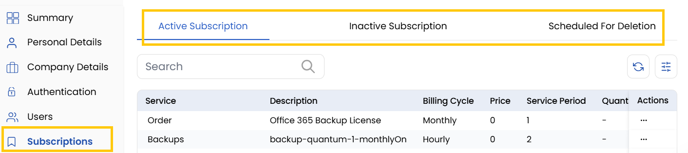

## Subscriptions

The **Subscription Tab** provides detailed insights into the client's subscriptions. Helps monitor the status of ongoing services and manage new subscriptions.

- **Active Subscriptions** - Displays active services currently in use.
- **Inactive Subscriptions** - Lists services that are paused or disabled.
- **Scheduled for Deletion** - Shows subscriptions marked for removal.

### Conclusion
The Subscriptions tab offers complete visibility into service lifecycles, enabling effective management of active, inactive, and pending removal services.

:::tip
**See also:**  
- **[Orders](./Orders.md)**
- **[Resources](./Resources.md)**
- **[Customer Service](./Customer%20Services.md)**
:::