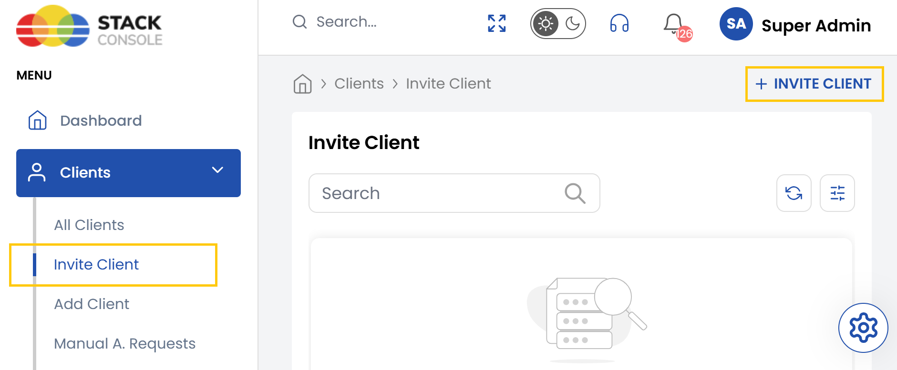
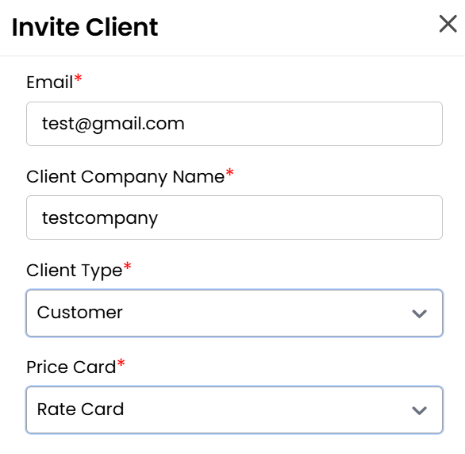
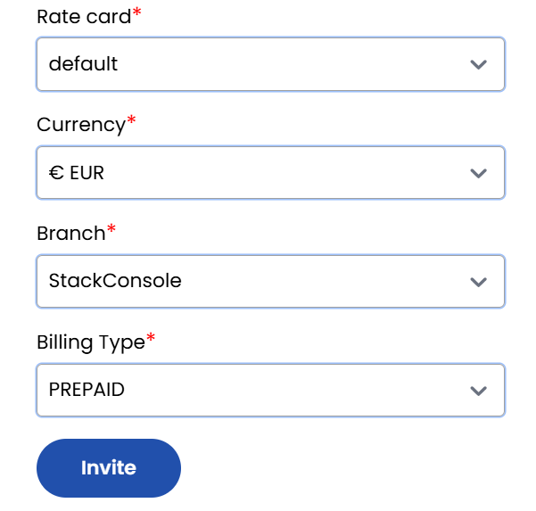

# Invite Client

The **Invite Client** feature allows you to onboard new clients by sending them email invitations to register in the system. This ensures secure and controlled access to your services.

- On the left-hand side menu, locate the **Clients** drop-down menu
- Click on **Invite Client** to access the page

- Enter the name, email and client type.

- Select the rate card, the client’s currency for transactions and specify the branch associated with this client.
- Choose one of the following billing type from the options:
    - **Prepaid** — Clients pay in advance for services.
    - **Postpaid** — Clients are billed after services are rendered.
    - **Manual** — Payments are handled manually outside automated billing systems.

- After entering the required information, click **Invite**. The system will send an email invitation to the specified email address.
- Client invitation sent successfully. The invited client will receive registration instructions via email.

### Conclusion
Inviting clients through the system provides a secure and efficient way to initiate account creation. By pre-configuring key settings and automating the invitation process, administrators can maintain control while offering a seamless onboarding experience.

