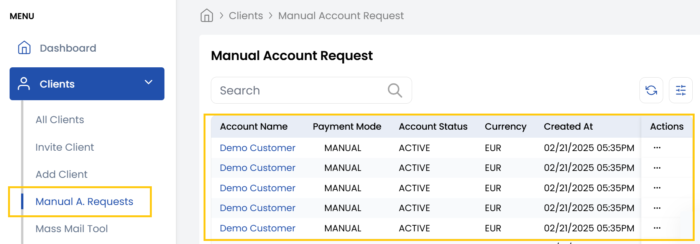

# Managing Account Requests

**Managing Account Requests** in a stack console involves efficiently reviewing, approving, or rejecting incoming requests. It provides options to either accept or reject these requests. 

- Accepting a request involves verifying the provided details and updating the account status accordingly, while rejecting a request requires marking it as rejected or deleted.

### Conclusion
The system maintains a complete audit trail of all processed requests. Approved clients will receive access credentials while rejected applicants may be notified depending on your configuration.