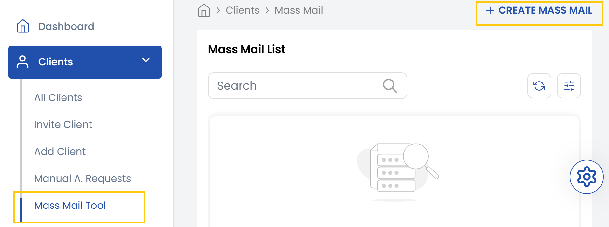
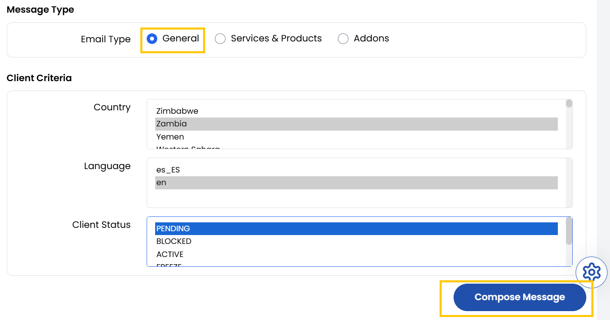
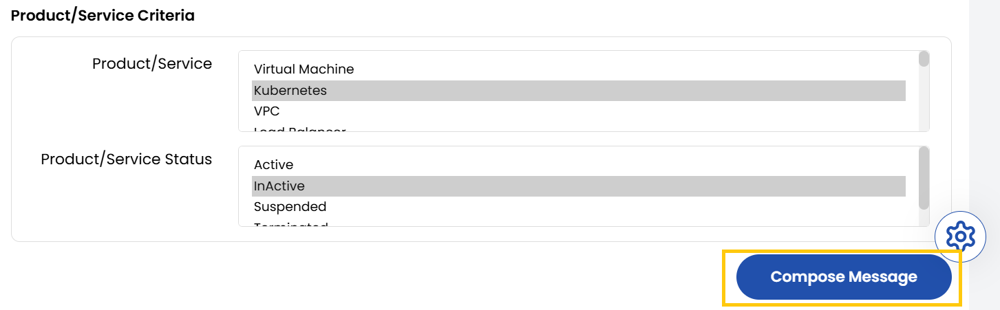
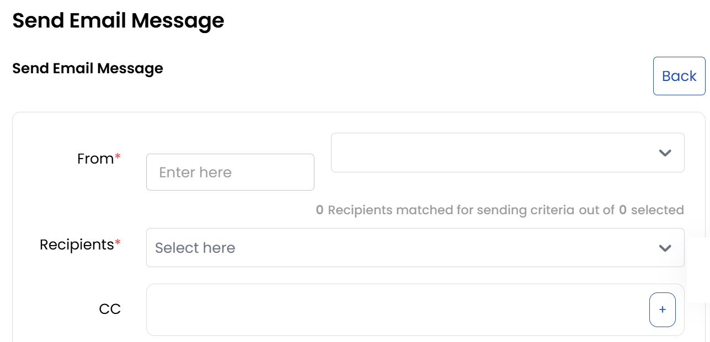
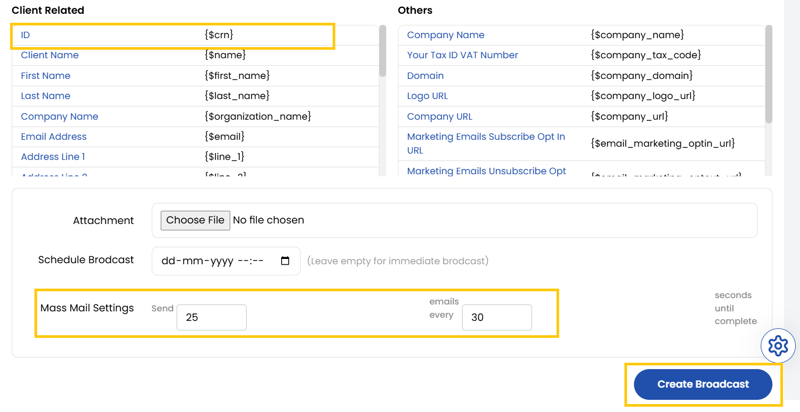

# Create Mass Mail

The **Mass Mail Tool** in the Stack Console enables administrators to create and send targeted email campaigns to clients based on various filters such as country, language, client status, and service usage. 

- In the **Client** section of the menu, click on the **Mass Mail** tool.
- Here, you can view existing Mass Mail emails or click on **Create Mass Mail** to start a new one. You can choose from General, Services & Products and Addons as message types.

### General

Mass Mail campaigns can be precisely targeted and scheduled for effective client communication.

- Select the Country, Language and Client Status. You can choose from following Client Status:

    - **Pending**: The client's account is created but not yet fully activated or verified.
    - **Blocked**: The client’s account is restricted due to violations, security concerns, or manual action.
    - **Active**: The client’s account is fully operational and in good standing.
    - **Freeze**: The client’s account is temporarily paused, preventing changes or new activity but maintaining existing data.
    - **Suspend**: The client’s account is temporarily disabled, often due to overdue payments or policy issues.
    - **Terminate**: The client’s account is permanently closed, either by request or administrative action.

- Click on **Compose Message** to compose the email message.

### Services & Products

- Select the Country, Language and Client Status. Select the product or service. You can choose Service Status from the following:

    - **Active**: The service or product is fully functional and accessible to the client.
    - **Inactive**: The service or product is available but not currently in use by the client.
    - **Suspended**: The service or product is temporarily disabled, often due to non-payment, policy issues, or maintenance.
    - **Terminated**: The service or product has been permanently deactivated and is no longer accessible.

- Click on **Compose Message** to compose the email message.

### Addons

- Select the Country, Language and Client Status. Select the addon criteria. You can choose Service Status from the following:

    - **Active**: The add-on is enabled and available for use.
    - **Inactive**: The add-on is available but not currently assigned or active for the client.
    - **Suspended**: The add-on is temporarily disabled, often for billing or security reasons.
    - **Terminated**: The add-on is permanently removed and cannot be reactivated without a new purchase.

- Click on **Compose Message** to compose the email message.

### Send Email Message

- Compose a body for an email and add recepients.

- You can add tags in your email they are used in email templates to automatically insert personalized client data. When the email is sent, these tags are replaced with the corresponding client information from your database.

- You can schedule the email and specify the number of emails to be sent at intervals of a few seconds.
- Once all details are filled out, click **Create Broadcast** to initiate the email campaign.
- Mass Mail campaigns can be precisely targeted and scheduled for effective client communication.

### Conclusion
The Mass Mail Tool offers a structured and flexible approach to client outreach. With customizable filters, personalized templates, and scheduling options, it ensures your communication is relevant, timely, and efficient.