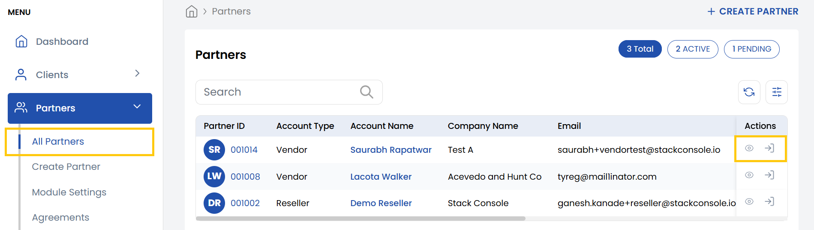
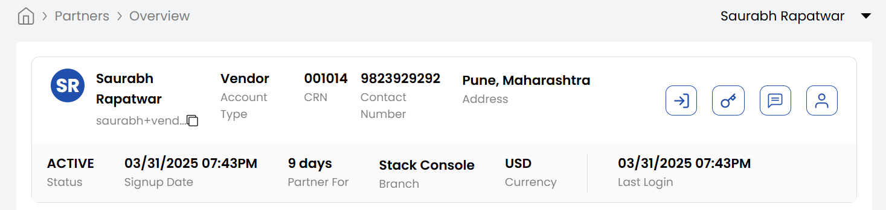

## Accessing Partner

**Stack Console** provides a streamlined way to access and manage partner accounts. This guide covers how to view partner lists, log in to partner dashboards, and access detailed partner information.

- From the left-hand menu, navigate to the **Partners** section.  
- Click **All Partners** to display a full list of registered partners.

### Logging Into a Partner Dashboard

- Locate the desired partner in the list.  
- Click the **Login** icon on the right side of their entry to access their dashboard directly.  

### Accessing Detailed Partner Information

- Click the **Partner ID** in the list or click the **View** icon next to the partner’s entry.
- Upon selecting a partner, the **Partner Details** page will appear. This page provides a comprehensive overview of the partner’s information, including:

    - **Name**: The name associated with the partner.
    - **Email Address**: The primary email address associated with the partner.
    - **Account Type**: Type of partner account as Reseller or Vendor.
    - **CRN Number**: The unique Partner Reference Number assigned to the partner.
    - **Contact Number**: The partner’s registered phone number.
    - **Address**: The partner's physical or mailing address.
    - **Sign-up Date**: The date when the partner was first registered in the system.
    - **Partner For**: Displays how many days the partner has been active since their sign-up date.
    - **Branch**: The specific branch or office the partner is associated with.
    - **Currency**: The currency in which transactions for this partner are processed.
    - **Last Login**: Displays the most recent date and time the partner logged into their account.  

### Conclusion

With these steps, you can efficiently manage vendor and reseller accounts in Stack Console, whether for troubleshooting, audits, or support. For advanced partner management features, refer to the Stack Console Documentation or contact support.
