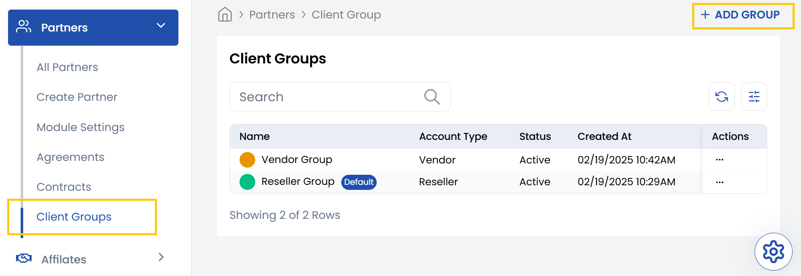
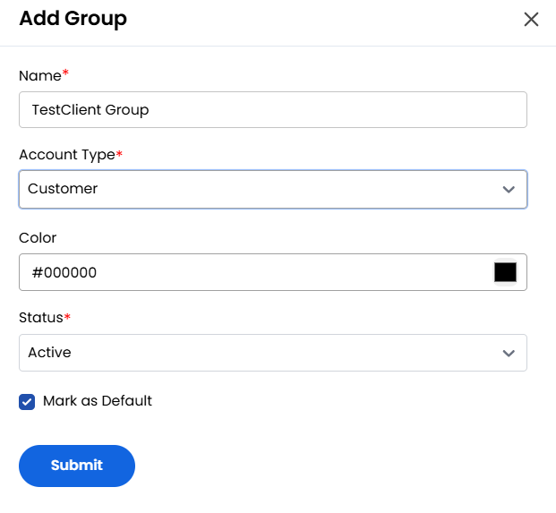

## Client Group

The **Client Group** tab allows you to segment and organize your clients based on their roles (customer, vendor, reseller), business logic, or operational needs. This makes it easier to apply policies, campaigns, or system rules to targeted groups instead of handling each client individually.

- From the left-hand side menu, select the **Partners** section. Navigate through the sub-sections and click on **Client Groups** tab to view the existing client groups.
- To create new client groups, click on **Add Group** on the right-hand side of the page.

- Give a **Name** to your client group and choose account type. You choose color for customization and select status as **Active** or **Inactive**. 
- Alternatively, you can click the checkbox to mark it as default, click on **Submit**.
.
