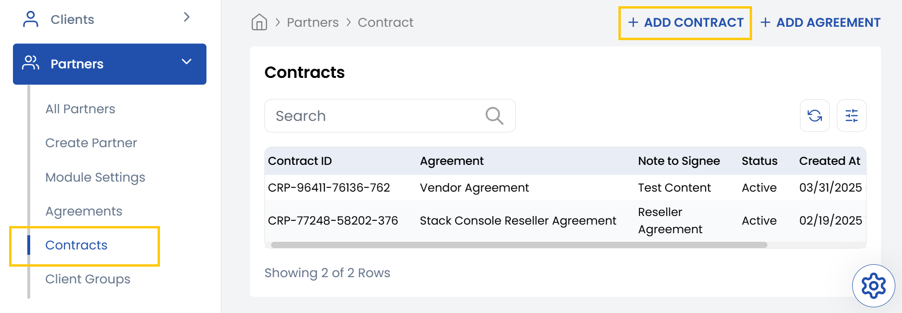
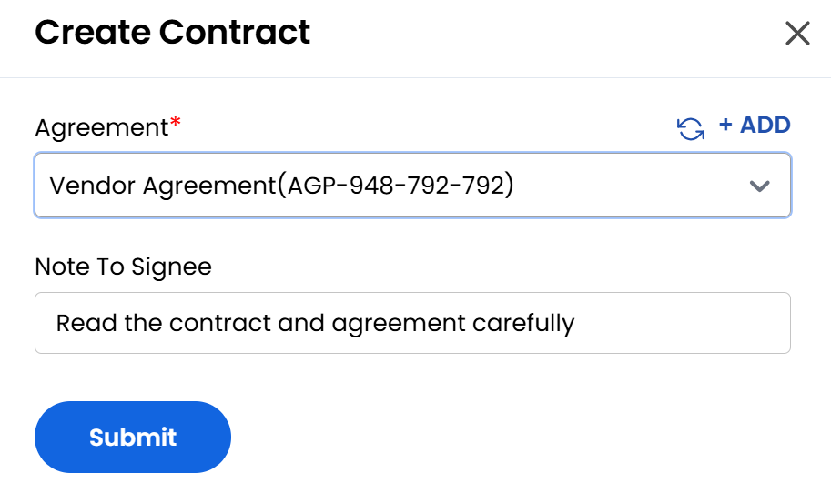

## Contracts

The **Contracts** tab is where you manage individual contractual documents that are tied to broader Agreements with vendors or resellers. Contracts provide more specific, actionable details that fall under the scope of a master agreement. Contracts typically include identifying information, links to their parent agreement, and any signing notes required for execution.

- From the left-hand side menu, select the **Partners** section. Navigate through the sub-sections and click on **Contracts** tab to view the existing contracts.
- To create new contract, click on **Add Contract** on the right-hand side of the page.

- Select the **Agreement** which will be linked to the contract. Add any important instructions or details regarding signing the contract in **Note to Signee** box.
- Click **Submit** to create the new contract associated with agreement.

