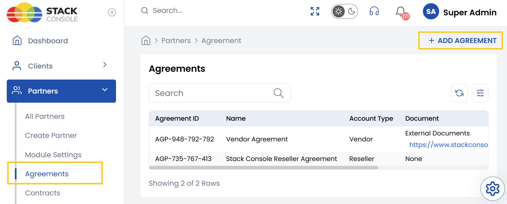
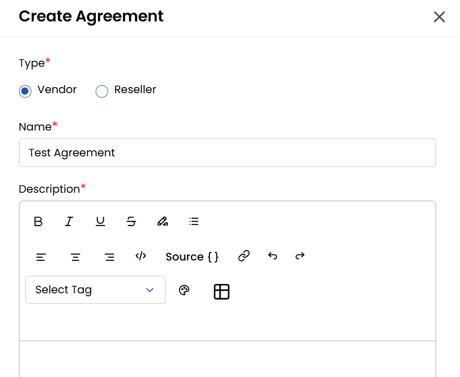

## Agreements

The **Agreements** tab serves as the foundation for formalizing your partnerships. Agreements represent high-level legal or operational arrangements between your organization and a vendor or reseller. These can include terms of service, pricing models, or general partnership conditions.

- From the left-hand side menu, select the **Partners** section. Navigate through the sub-sections and click on **Agreements** tab to view the existing agreements.
- To create new agreement, click on **Add Agreement** on the right-hand side of the page.

- Choose the type of agreement **Vendor** or **Reseller**. Enter **Name** and add the **Description** for the agreement. 

- Each agreement can also be attached with the supporting documents either uploaded as files or referenced via external links. Once, done click on **Submit** to create an agreement.

