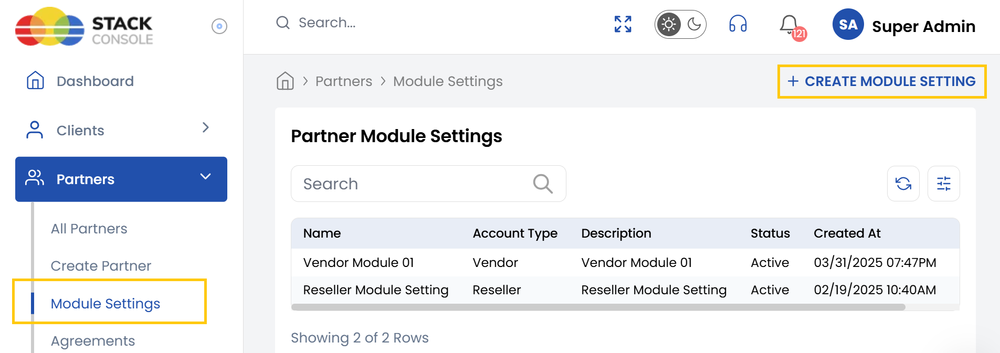
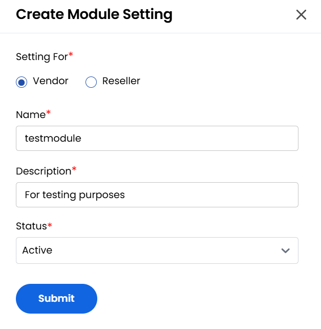

## Module Settings

The **Module Settings** tab is where you define how different partner types like vendors or resellers to interact with your system. These settings can control access levels, business rules, operational roles, and other model-specific configurations for each partner type.

This allows you to customize the behavior of your platform for different types of partnerships and ensure each partner operates within the correct framework.

- From the left-hand side menu, select the **Partners** section. Navigate through the sub-sections and click on **Module Settings** tab to view the existing module settings.
- To create new module settings, click on **Create Module Setting** on the right-hand side of the page. 

- Select whom you are creating module setting for **Vendor** or **Reseller**.
- Enter the **Name**, **Description** and choose **Status** as active or inactive for the module setting.
- Click **Submit** to save the configuration. Once submitted, the new module setting will be visible in the list.

