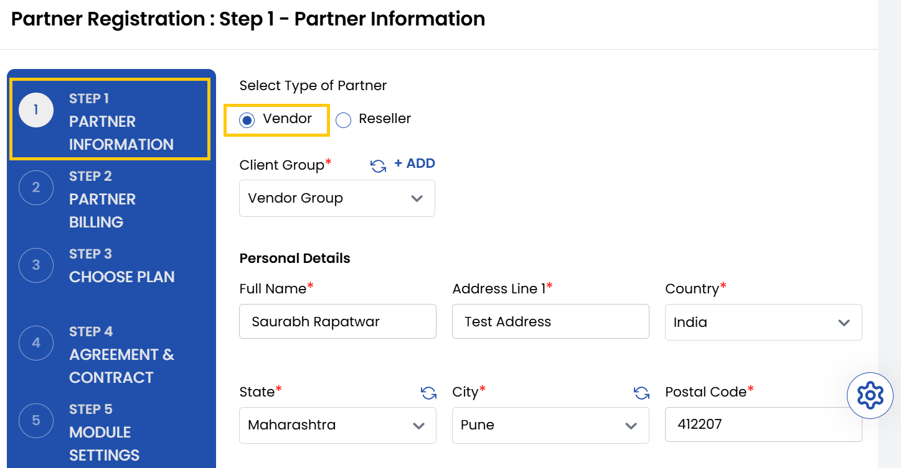
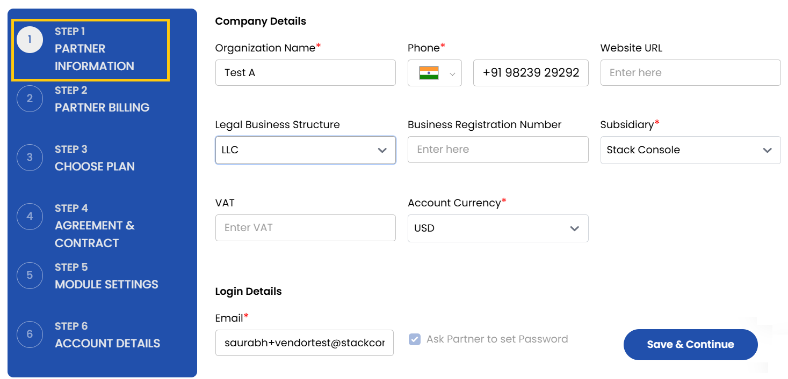
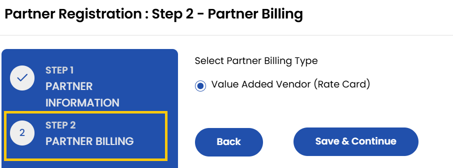
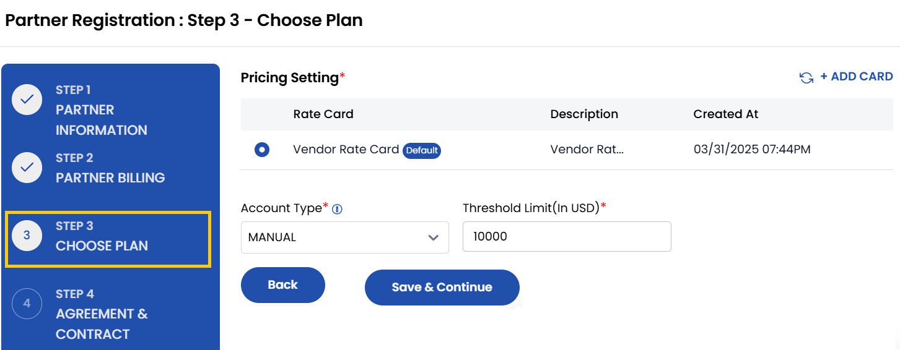
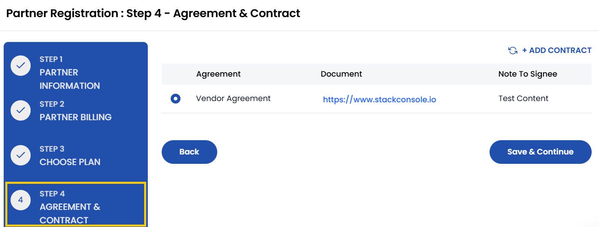
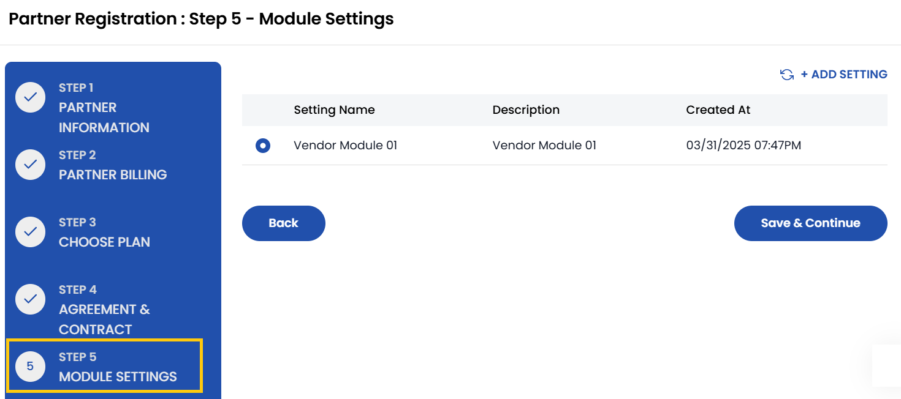
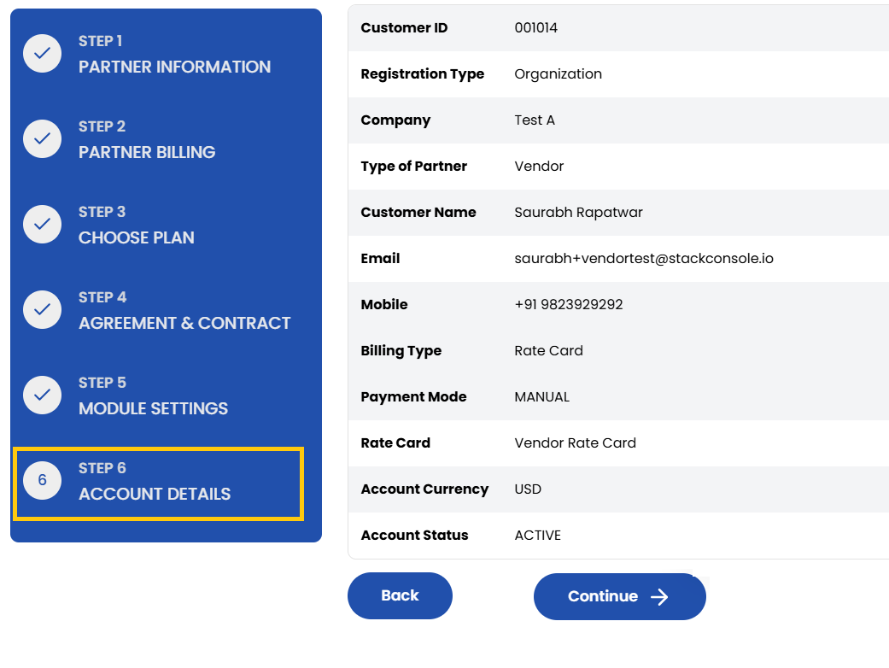
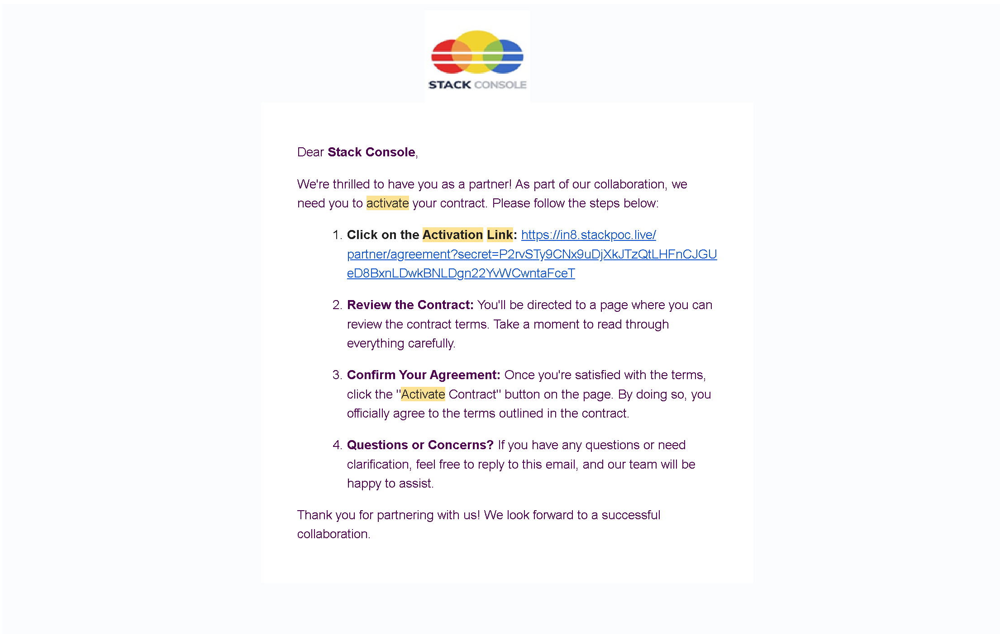
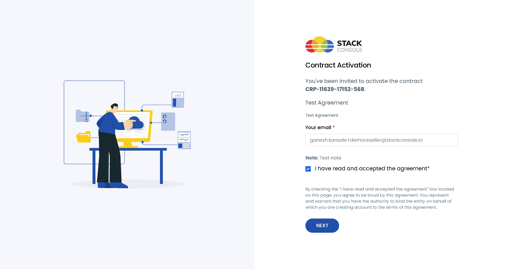
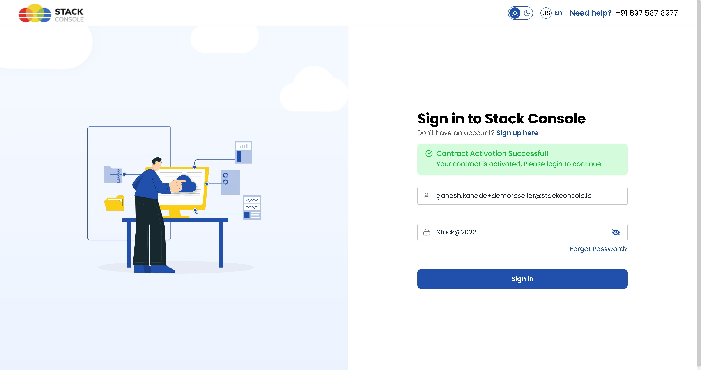

## Create Vendor

- From the left-hand side menu, select the **Partners** section. Navigate through the sub-sections and click on **Create Partner** tab to create partner.
- To create new Vendor, select type of Partner as **Vendor**.

- Select the appropriate **Client Group** that the vendor will belong to. 
- Enter the name and add the address of the vendor, including street, city, and postal information.

- Provide company details such as:
    - **Organization Name** – The name of the company.
    - **Organization Number** – Phone number associated with the organization.
    - **Website URL** – Company’s website address.
    - **Legal Business Structure** – Type of business (e.g., LLC, Sole Proprietorship, Corporation).
    - **Business Registration Number** – Official registration ID.
    - **Subsidiary** – Subsidiary associated with business.
    - **Account Currency** – Select the currency in which transactions will be handled.
    - **VAT/GST** – Add GST information if applicable.

- Provide the email address for the vendor's login. Select the option **Ask Partner to set the password** to let them set it themselves, or you can set a default password.
- Once login info is set, click on **Save and Continue**.

- From **Partner Billing** page select the Billing Type, by default it is Value-Added Reseller. Click on **Save and Continue**.

- Choose a Plan from pricing settings which include rate cards. Choose the account billing type and set threshold limit on spend. Click on **Save and Continue**.

- Choose the **Contract** associated with agreement that will apply to the reseller. Click on **Save and Continue**.

- Select the specific **Modules Settings** that the reseller will have access to interact with your system.

- The Account Details page will show you the summary of all the entered details. Carefully review each section and click on **Continue**. You have successfully registered you Reseller. 

- Once you have registered your Vendor, a link will be sent to your registered email account. Click on that link to activate contract.

- Enter your registered email ID. Read the Vendor Agreement carefully and accept the agreement. Click on **Next** to continue.

- Set a strong password for your account. Click on that link to **Set & Activate** to activate contract.

- Now, final step is to sign in into your account. Enter your login credentials and click on **Sign In** to access the Vendor portal.

## Conclusion

The Create Vendor process provides a structured and comprehensive way to onboard vendors into your system. By capturing essential details such as company information, billing setup, contract agreements, and module access, you ensure each vendor is properly configured to operate within your platform.

