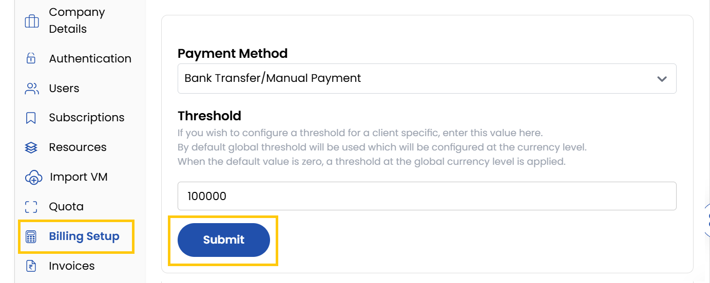
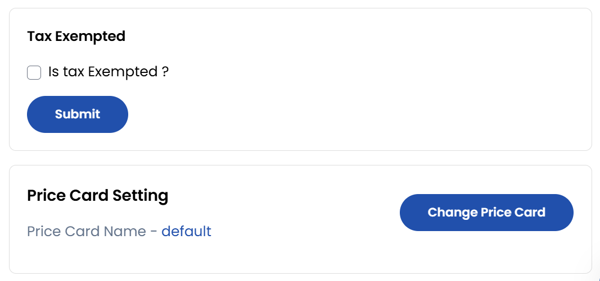

## Billing Setup

The **Billing Setup** tab enables customized billing configurations, ensuring clients are charged correctly and alerts are in place for budget management.

- Choose your preferred payment method from the available options.
- Set spending limits to trigger alerts when a client's expenditure reaches a specified amount. Helps manage budget controls effectively. Click on **Submit**.

:::note

If you wish to configure a threshold for a client specific, enter this value here.
By default global threshold will be used which will be configured at the currency level.
When the default value is zero, a threshold at the global currency level is applied.

:::

- Enable the **Tax Exempted** checkbox to exclude the client from tax charges.
- To modify pricing plans for the client, click on **Change Price Card**. Select the appropriate **Rate Card** and click Update to apply the changes.

### Conclusion
The Billing Setup provides essential controls for managing client billing preferences and budget alerts, ensuring accurate financial administration.

:::tip
**See also:**  
- **[Rate Card](../../Settings/Billing%20Setup/Rate%20Cards.md)**
- **[Taxation](../../Settings/Billing%20Setup/Taxations.md)**
:::