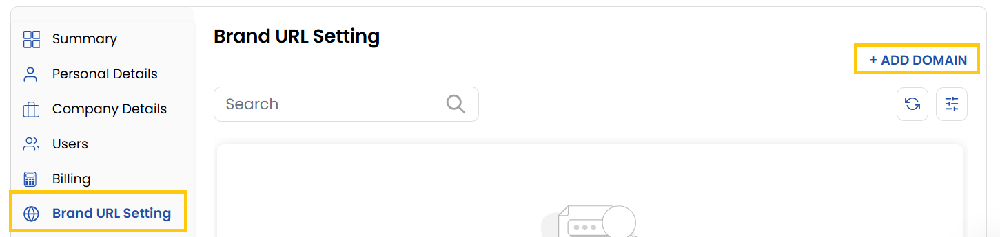
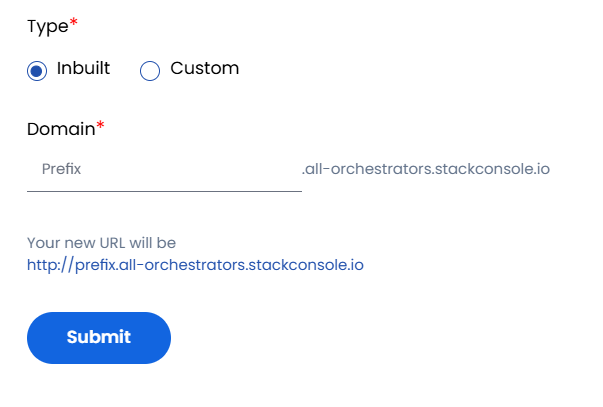
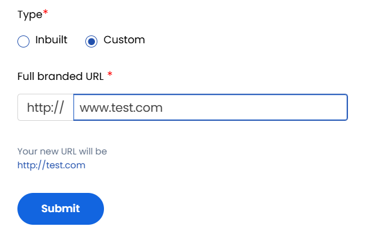

##  Brand URL (Only For Reseller)

Stack Console provides two whitelabeling options for resellers to offer a branded experience to their customers.

- You can view and create brand URL present currently. To create new brand URL, click on **Add Domain** on the right-hand side of the page. 

### Partially Branded URL - Inbuilt

With this option, a temporary, partially branded URL is created by default. Your customers and sub-resellers can use this URL to access the control panel.

- Click the **Login To Portal** button to access the control panel via the partially branded URL.
- You can customize the URL by updating its prefix. Enter your desired prefix and click **Change Prefix**.
- Your new URL will be generated and ready for use.

###  Fully Branded URL - Custom

This option allows you to use your own domain name for full whitelabeling of the control panel.
- Add your primary domain and click **Save**.

### Conclusion
The Brand URL setting empowers resellers to deliver a customized, branded experience through either a partially or fully whitelabeled domain. This enhances brand identity and provides a seamless access point for customers and sub-resellers.

:::tip
**See also:**  
- **[Brand URL](../../../reseller/Brand%20URL)**
:::