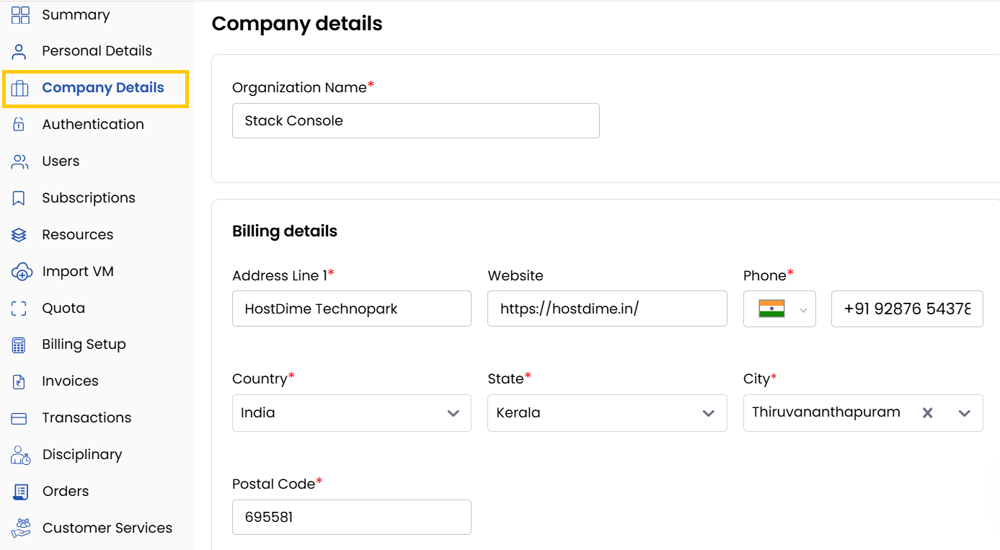

### Company Details

Accurate company information is essential for managing subscriptions and payments. This section allows you to add or update your billing address and phone number for invoicing purposes.

- Select **Company Details**, enter the organization name, business registration number, choose legal business structure (e.g., LLC, Sole Proprietorship, Corporation).
- In **Billing Details** add or update the **Billing Address** and **Phone Number**.
- Add **VAT Number** (If applicable) used for tax purposes. Click on **Submit** to save changes.

### Conclusion
Maintaining updated company details ensures accurate invoicing and compliance with tax requirements, streamlining your billing operations.