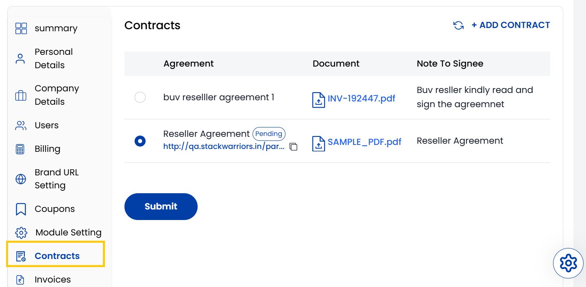

## Contracts

The **Contracts** tab is where you manage individual contractual documents that are tied to broader Agreements with vendors or resellers. Contracts provide more specific, actionable details that fall under the scope of a master agreement. Contracts typically include identifying information, links to their parent agreement, and any signing notes required for execution.

- You can view and manage contracts here. To create new contract, click on **Add Contract** on the right-hand side of the page.

