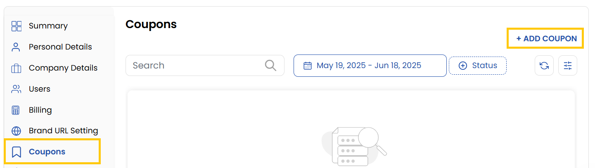

## Coupons

The **Coupon** tab in the Stack Console allows administrators to create and manage promotional coupons for their customers, vendors, or resellers. Coupons can provide free services or percentage-based discounts, and can be configured with specific usage rules, billing cycles, and applicable services. 

- You can view and manage coupons here. To create a new coupon, click on **Add Coupon** on the right-hand side of the page.

