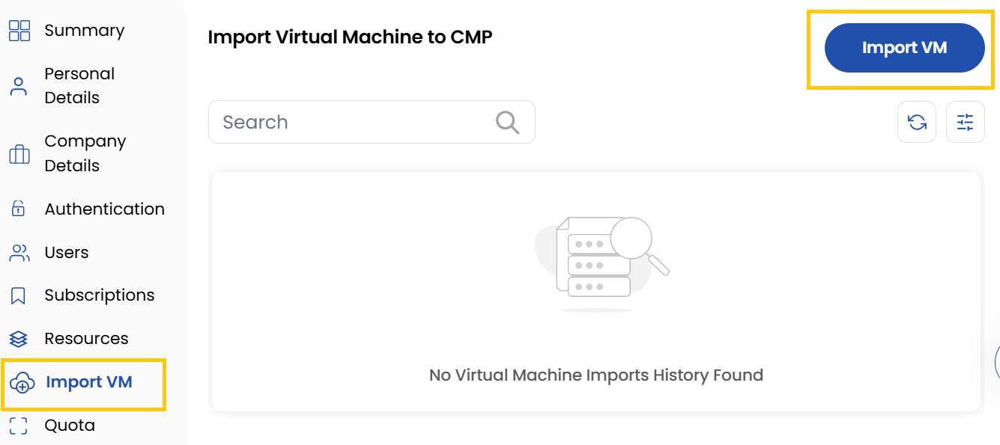
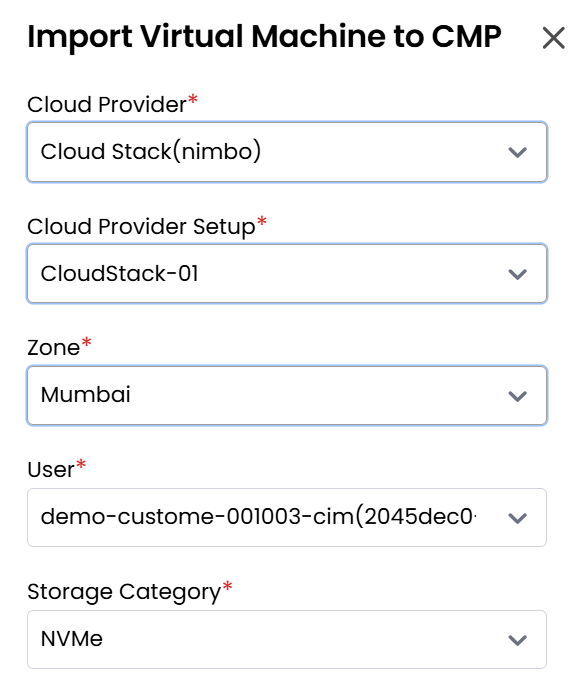
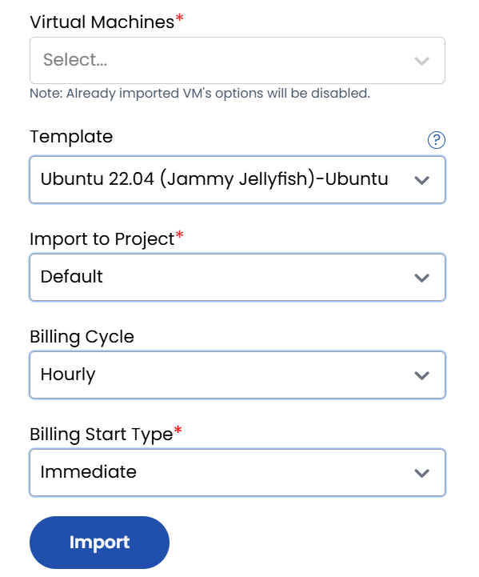

## Importing Virtual Machine

The **Import VM** feature allows administrators to migrate existing virtual machines from supported cloud providers into your current infrastructure. This streamlined process maintains your VM configurations while enabling flexible deployment options and billing management within Stack Console.

- The **Import VM** tab shows the imported virtual machines list.
- Click on **Import VM** to import a virtual machine.

- Select the **Cloud Provider** and the corresponding **Cloud Provider Setup**.
- Choose the **Zone** where you want your server to be hosted and select the **User** for the project.

- Select the **Storage**, **Virtual Machine**, **Template**, and **Project** you wish to import.
- Choose the desired **Billing Cycle** (Hourly, Monthly, or Yearly) and select the **Billing Start Type**.
- Click on **Import** to complete the import process successfully.

### Conclusion
The Import VM feature enables seamless migration of virtual machines from various cloud providers with flexible billing options and deployment configurations.