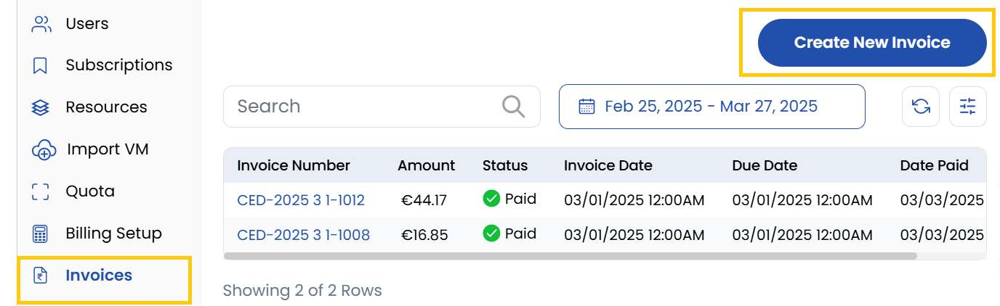
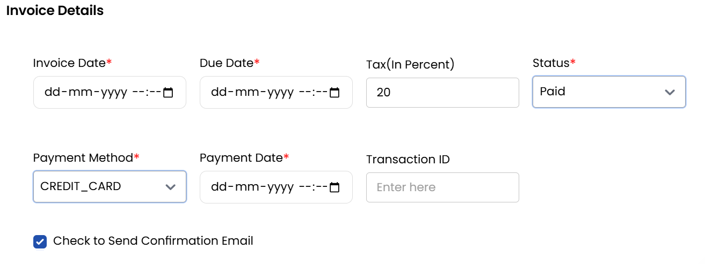
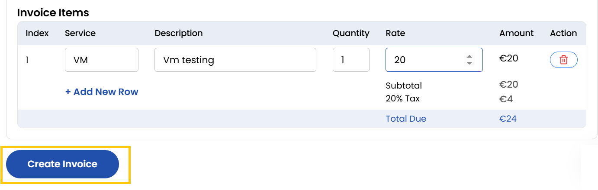

## Invoices

Displays all past and current invoices associated with the client. Use filters to search or sort invoices by date, status, or amount.

- To create a new invoice, click on the **Create New Invoice** button.

### Creating an Invoice

- Enter the following invoice details:
    - **Invoice Date**: Enter the issue date of the invoice.
    - **Due Date**: Specify the payment deadline.
    - **Tax Percentage**: Add the applicable tax rate.
    - **Status**: Paid, Unpaid and Draft (if you plan to finalize it later).

### Adding Invoice Items

- Once the invoice is created, you can add individual items with:
    - **Service**: Define the type of service provided.
    - **Description**: Add details about the service.
    - **Quantity**: Enter the quantity for accurate billing.
    - **Rate**: Specify the per-unit rate.
    - **Amount**: The total calculated amount for each item.

- Once all details are finalized, click **Create Invoice** to confirm.

### Conclusion
The Invoices section provides comprehensive tools for generating, tracking, and managing client billing, ensuring accurate financial records and timely payments.

:::tip
**See also:**  
- **[Create Invoices](../../Settings/Billing%20Setup/Invoice%20Number.md)**
- **[Taxation](../../Settings/Billing%20Setup/Taxations.md)**
:::