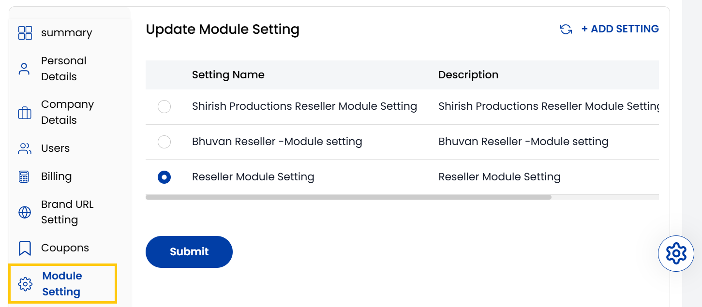

## Module Settings

The **Module Settings** tab is where you define how different partner types like vendors or resellers to interact with your system. These settings can control access levels, business rules, operational roles, and other model-specific configurations for each partner type.

- You can view and manage module settings present currently. To create new module settings, click on **Add Setting** on the right-hand side of the page. 

:::tip
**See also:**  
- **[Create Module Settings](../../Partners/Create%20Module%20Settings.md)**
:::