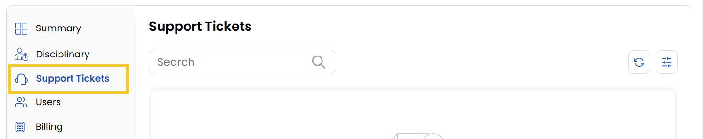

## Support Tickets

The **Support Tickets tab** manages customer support interactions. Ensures client issues are tracked and resolved efficiently.

- **Open Tickets** - Tracks unresolved requests.
- **Closed Tickets** - Displays resolved issues.
- **Ticket History** - Shows a complete record of client support requests.

### Conclusion
The Support Tickets tab provides organized tracking of customer issues from submission through resolution, ensuring timely responses and complete historical records.

:::tip
**See also:**  
- **[Support Dashboard](../../Support/Support%20Dashboard.md)**
- **[Support Tickets](../../Support/Support%20Tickets.md)**
:::