### Setup Admin Profile in Stack Console {#profile}

The **Stack Console** admin profile setup feature allows users to manage their personal information, change passwords, configure payment settings, add users, roles, and monitor account activity. This feature provides users with a detailed overview of their account and allows for customization and control.

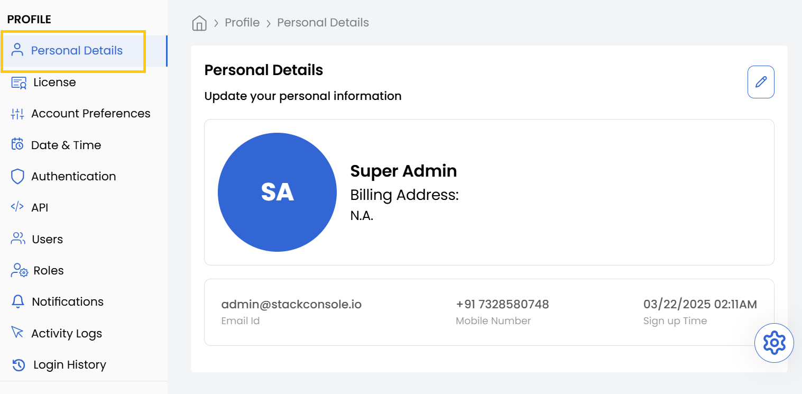

### Update Your Personal Information

Keep your personal details up-to-date to ensure that your profile reflects accurate information. This section allows you to update essential fields such as name, contact number, and address.

- Navigate to the **Profile** section from the left-hand menu.
- Select **Personal Details** to update your personal information.
- Click on **Submit** to save changes.

### Manage Billing Information

Accurate billing information is essential for managing subscriptions and payments. This section allows you to add or update your billing address and phone number for invoicing purposes.

- Navigate to the **Profile** section from the left-hand menu.
- Select **Personal Details** and go to **Billing Details**.
- Add or update the **Billing Address** and **Phone Number**.
- Click on **Submit** to save changes.

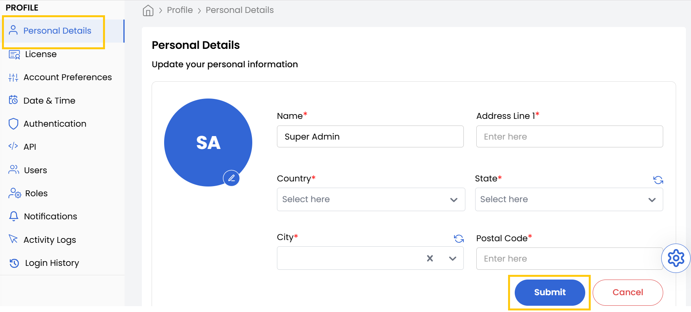

### View License Information

The **Account Limits** feature allows users to view resource usage and request increases as required.

- Navigate to the **Profile** section from the left-hand menu.
- Select **Account Limit** to view the resource allocation table.
- Click **Request To Increase** to submit a request for additional resources.

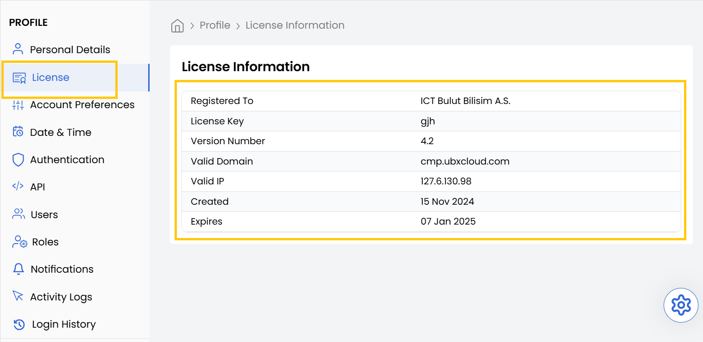

### Customize Account Preferences

Choose how you interact with the dashboard by customizing your account preferences. This section allows you to switch between different visual modes to match your desired experience.

- Navigate to the **Profile** section from the left-hand menu.
- Select **Account Preferences**.
- Choose between **Light Mode** and **Dark Mode**.
- Toggle your preferred mode, and the changes will be applied instantly.

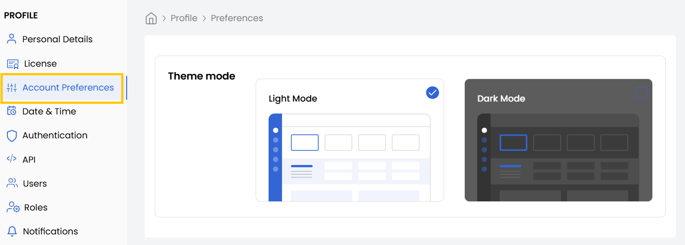

### Change Date and Time Settings

Ensure the date and time format aligns with your preference, especially if you're working across different regions. 

- Navigate to the **Profile** section from the left-hand menu.
- Select **Date and Time Settings**.
- Choose your **Preferred Time Zone** and **Date Time Format**.
- Click **Submit** to apply the changes.

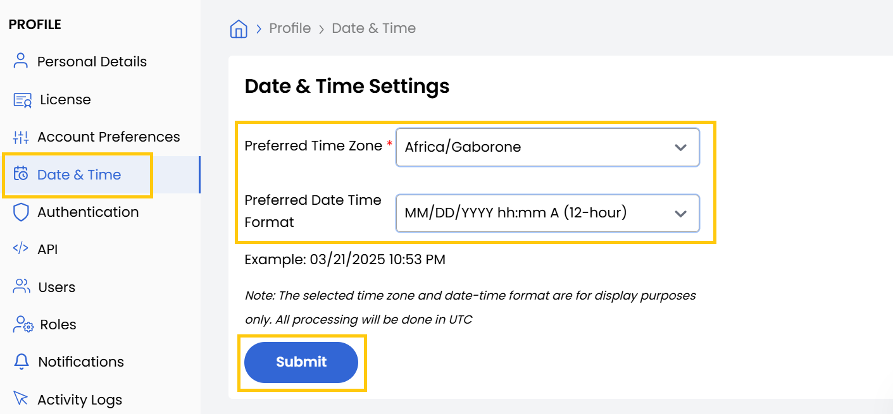

### Secure Your Account with Two-Factor Authentication {#enable-2fa}

Enhance security by enabling **Two-Factor Authentication (2FA)**, which adds an additional layer of protection to your login process.

- Navigate to the **Profile** section from the left-hand menu.
- Select **Authentication**, then locate **Two-Factor Authentication (2FA)**.
- Click **Set Up** under **Email Authentication**.
- Enter your **Email ID** and click **Send OTP**.
- Enter the OTP sent to your email.
- Toggle **Enable 2FA for All Users** if you want it enforced across your organization.

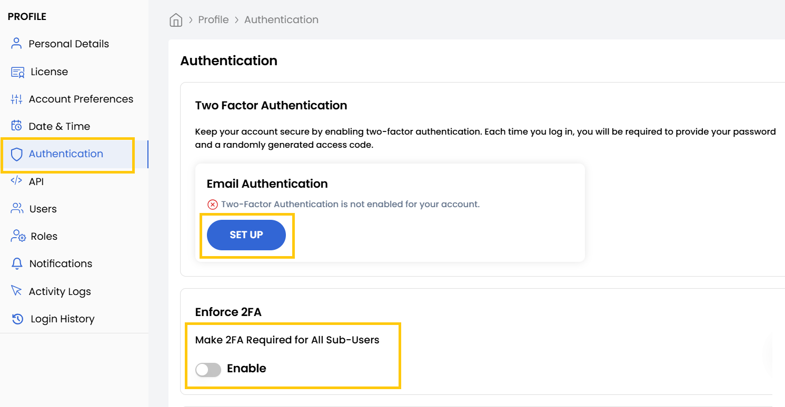

### Change Your Password

To maintain account security, it's essential to change your password periodically.

- Navigate to the **Profile** section from the left-hand menu.
- Select **Authentication**, then click on **Change Password**.
- Enter your **Current Password**, then enter and confirm your **New Password** and click **Change Password** to save changes.

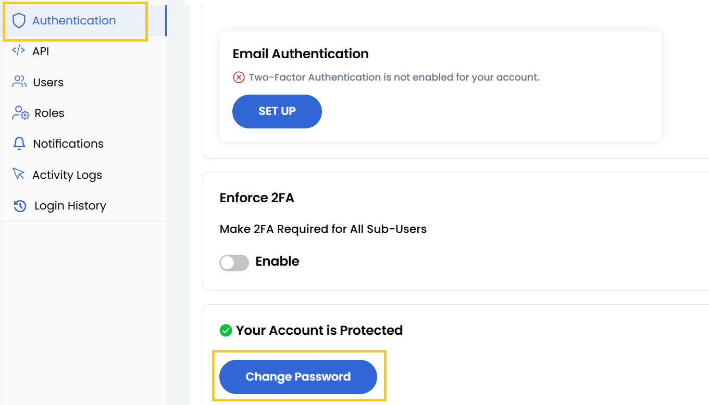

### Add a New User {#new-user}

The **Users** section allows you to add new users to your organization and assign specific roles and permissions.

- Navigate to the **Profile** section from the left-hand menu.
- You can view Users and manage them by using action buttons to edit and re-invite user. To add user Select **Users** and click on **Add User**.
- Enter the user details and select their **Role** and click **Submit** to create the user.

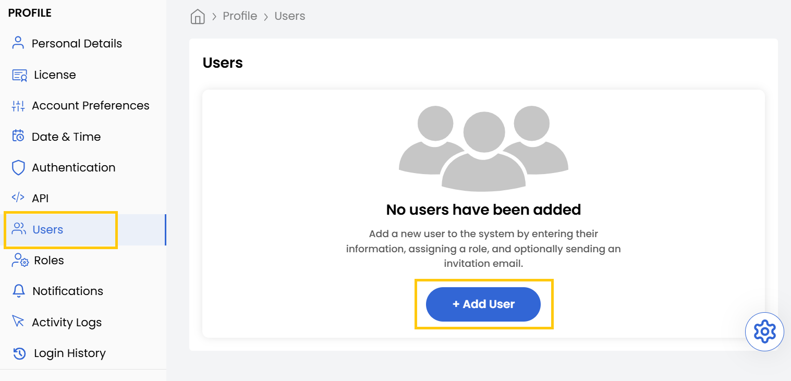

### Assign User Roles and Permissions

The **Roles** section allows you to assign and manage specific roles and permissions for each user within your organization.

- Navigate to the **Profile** section from the left-hand menu.
- Select **Roles** to view and assign permissions.
- Click **Add New Role** to create a new role with customized permissions.

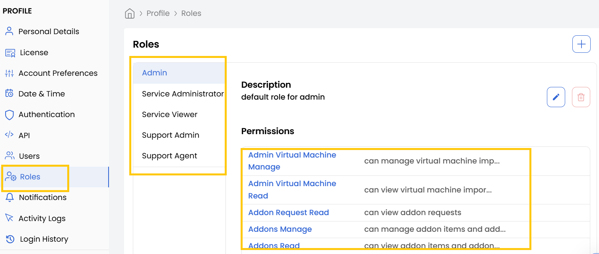

### Track Activity Logs

The **Activity Logs** feature provides a detailed record of user and system activities within the platform.

- Navigate to the **Profile** section from the left-hand menu.
- Select **Activity Logs** to monitor system actions and changes.
- Use the search bar to filter logs based on keywords.

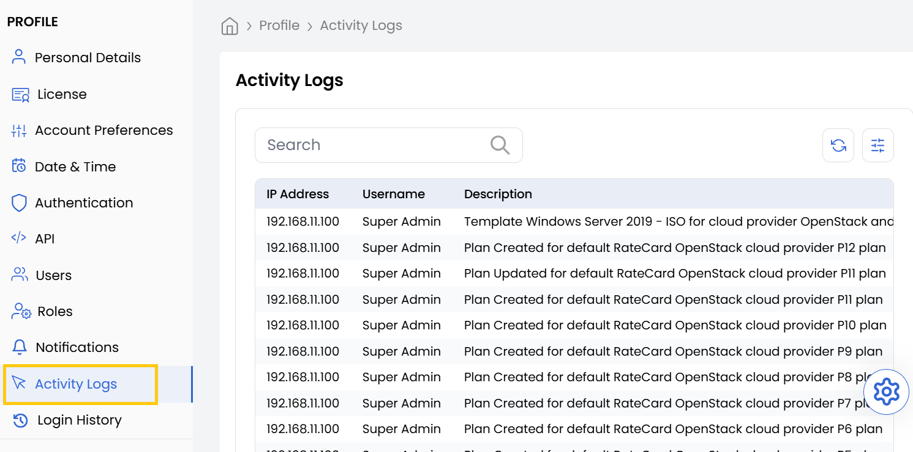

### Review Login History

The **Login History** feature allows users to monitor account access and verify security by reviewing login activities.

- Navigate to the **Profile** section from the left-hand menu.
- Select **Login History** to view login records.

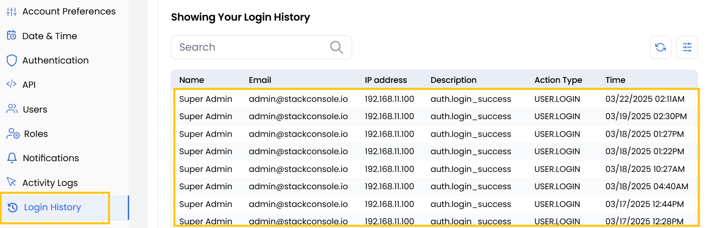

### Conclusion

By following this guide, you can efficiently manage your Stack Console profile, enhance security settings, and customize your account to meet your needs. Keeping your profile up-to-date ensures smooth account management and improved security within the platform.