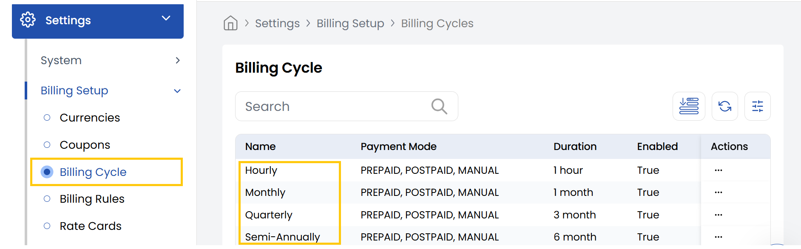

## Billing Cycle

The **Billing Cycle** tab in the Stack Console defines how frequently customers are charged for their subscribed services. Each cycle represents a different payment interval and is tailored to match a variety of use cases—from flexible hourly billing to deeply discounted long-term plans.

- From the left-hand side of the page under the **Billing Setup** section, click on **Billing Cycle** to view the list of billing cycles.

Below is a quick summary of all supported billing cycles and their intended purpose:

- **Hourly:** Charges every hour are perfect for short-lived or on-demand resources like VMs.
- **Monthly:** Charges every 1 month is ideal for flexible, short-term subscriptions.
- **Quarterly:** Charges every 3 months are good for users wanting moderate commitment with slight discounts.
- **Semi-Annually:** Charges every 6 months are suitable for mid-term users seeking better pricing.
- **Yearly:** Charges every 12 months are best for long-term users, typically at the highest discount.
- **Bi-Annually:** Charges every 24 months are designed for enterprise clients or multi-year deals with deep discounts.
- **Tri-Annually:** Charges every 36 months are for maximum commitment and lowest effective cost per month.

----------

### Conclusion
The Billing Cycle section provides flexible payment intervals to suit different customer needs, from hourly usage to long-term commitments. For billing cycle configuration assistance, contact Stack Console support.