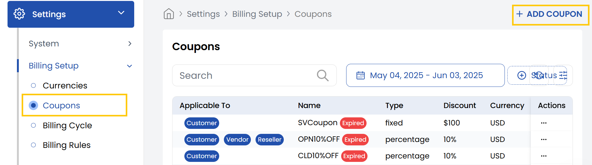
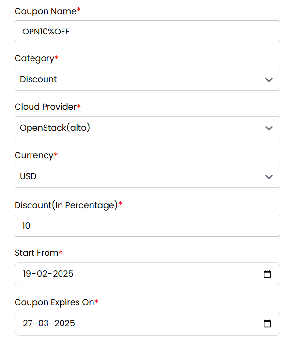
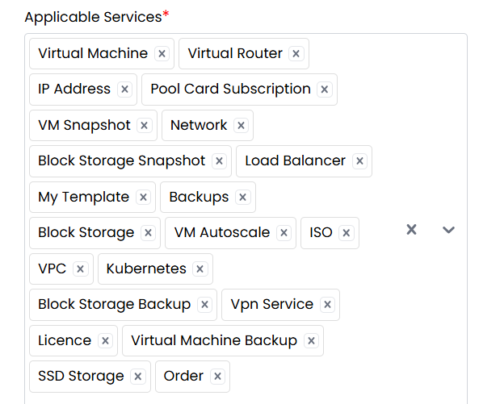
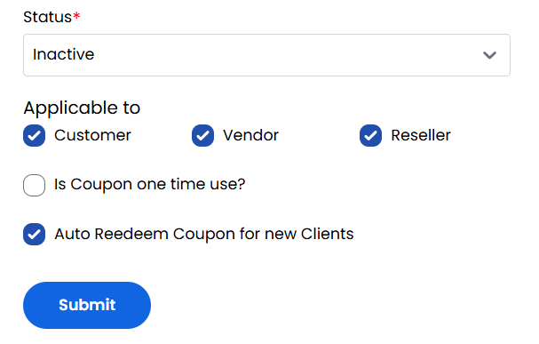

## Coupon

The **Coupon** tab in the Stack Console allows administrators to create and manage promotional coupons for their customers, vendors, or resellers. Coupons can provide free services or percentage-based discounts, and can be configured with specific usage rules, billing cycles, and applicable services. This guide walks you through the steps to successfully add a coupon.

- From the left-hand side of the page under the **Billing Setup** section, click on **Coupons** to view the list of coupons.
- To create a new coupon, click on **Add Coupon**.

- **Coupon Name:** Provide a unique name for the coupon.
- **Category:** Choose one of the following:
    - **Free Coupon** – For 100% discount or free service.
    - **Discount** – For partial discounts (e.g., 10%, 25%).
- **Cloud Provider:** Select the cloud provider for the coupon.
- **Currency:** Choose the currency that the discount will apply to (e.g., USD).
- **Discount (In Percentage):** Enter the discount rate.
- **Start From:** Select the date when the coupon becomes valid (format: dd-mm-yyyy).
- **Coupon Expires On:** Select the expiration date.

- **Applicable to No. of Users:** Specify how many users can use this coupon in total (e.g., 50).
- **Billing Cycles:** Select one or more billing cycles this coupon applies to (e.g., Monthly, Yearly).

- **Applicable Services:** Choose one or more services this coupon can be used for (e.g., Backup, Storage, Compute).

- **Status:** Set this to Active/Inactive to make the coupon available.
- **Applicable to:** Choose which user types (Customer, Vendor and Reseller) can use this coupon.
- **Is Coupon One Time Use?:** Check this box if each user can only use the coupon once.
- **Auto Redeem Coupon for New Clients:** Check this box if the coupon should automatically apply to newly registered users.

Review all the entered data carefully. Click **Submit** to save and activate the coupon.

----------

### Conclusion
The Coupon section provides flexible promotional tools to attract and retain customers through customizable discounts. For coupon configuration assistance, contact Stack Console support.