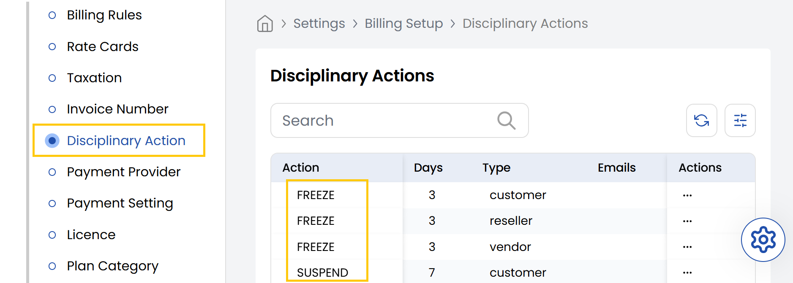

The **Disciplinary Action** tab includes tools to manage user behavior through disciplinary actions like FREEZE, SUSPEND, and TERMINATE. These actions help enforce policies and protect the platform by temporarily or permanently restricting access for customers, resellers, or vendors. This guide explains how to apply each action and when to use them.

- From the left-hand side of the page under the **Billing Setup** section, click on **Disciplinary Action** to view the list of disciplinary actions.

- **FREEZE**: Temporarily restricts account access for a short duration.
- **SUSPEND**: Disables account access for a moderate period due to policy violations.
- **TERMINATE**: Permanently deactivates the account after severe or repeated violations.

