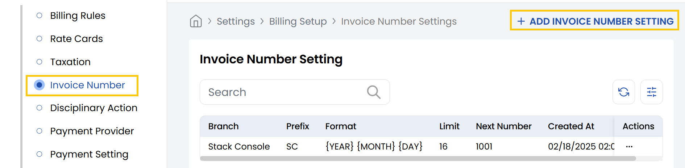
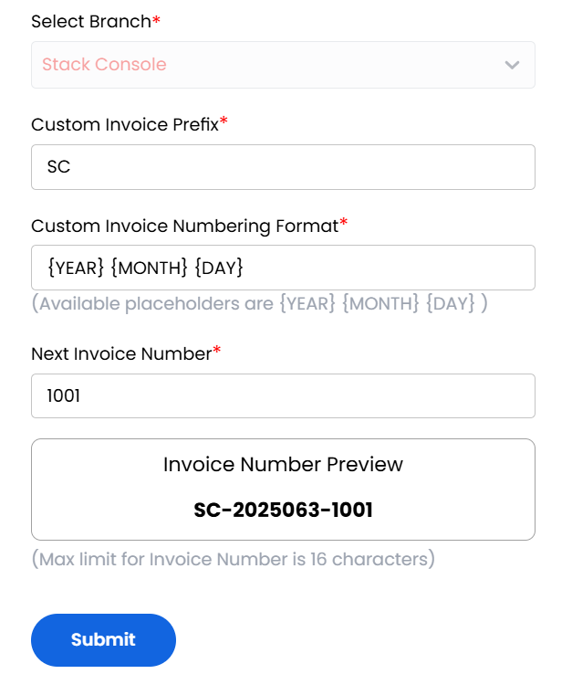

## Invoice Number

The **Invoice Number** tab in the Stack Console allows administrators to define custom invoice numbering formats for different branches. This ensures consistency and clarity in financial documentation. You can set a custom prefix, choose a date-based format, and control the next invoice number all within system limits.

- From the left-hand side of the page under the **Billing Setup** section, click on **Invoice Number** to view the list of invoice settings.
- To create a new invoice setting, click on **Add Invoice Number Setting**.

- **Select Branch:** Choose the branch for which you want to set a custom invoice numbering scheme.
- **Custom Invoice Prefix:** Enter a short, unique prefix for the invoice number (e.g., SC for Stack Console).
- **Custom Invoice Numbering Format:** Choose the date placeholders to include in the format (Example format: (YEAR MONTH DAY) results in 20250521).
- **Next Invoice Number:** Enter the starting number from which the invoices should continue (e.g., 1001).
Make sure the total length (prefix + date + number) does not exceed 16 characters.
- **Invoice Number Preview:** The system will auto-generate a preview (e.g., SC-20250521-1001) to help confirm the structure.

Review the preview and input values. Click **Submit** to apply the invoice number settings for the selected branch.