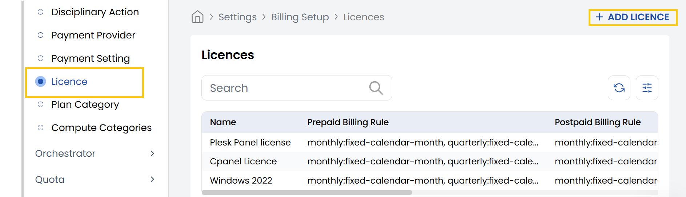
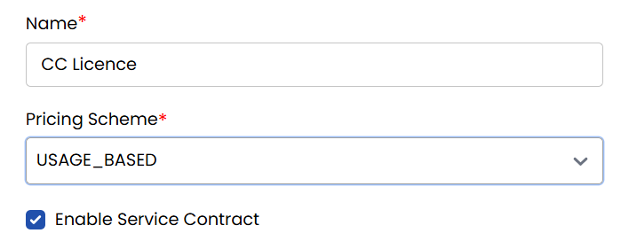
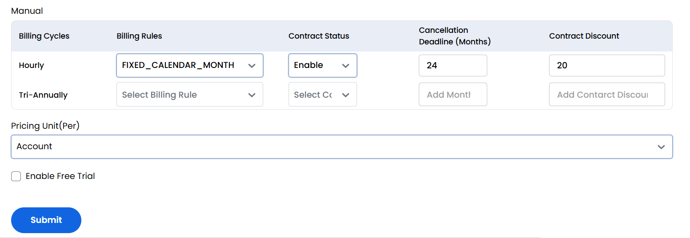
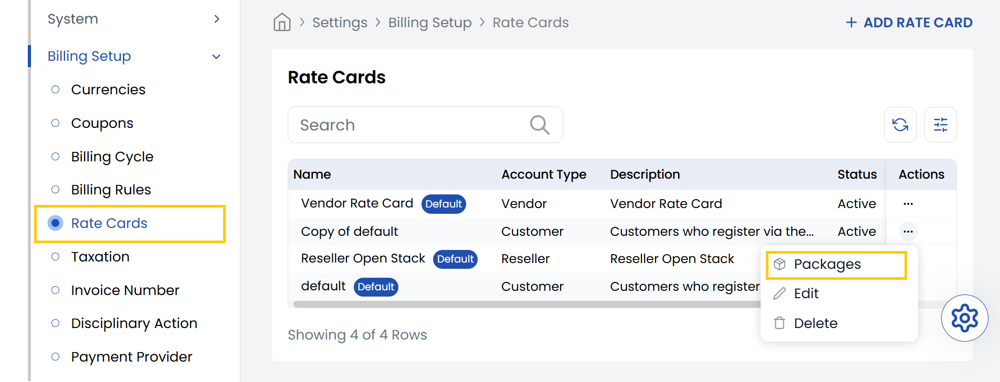
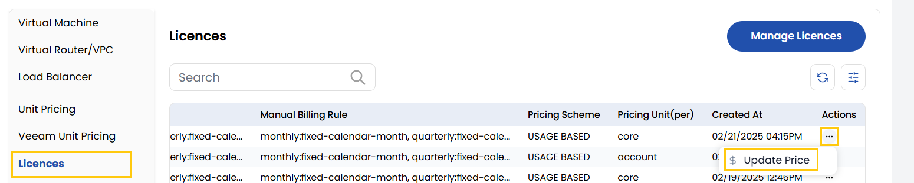
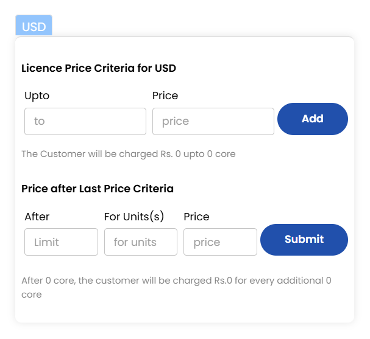
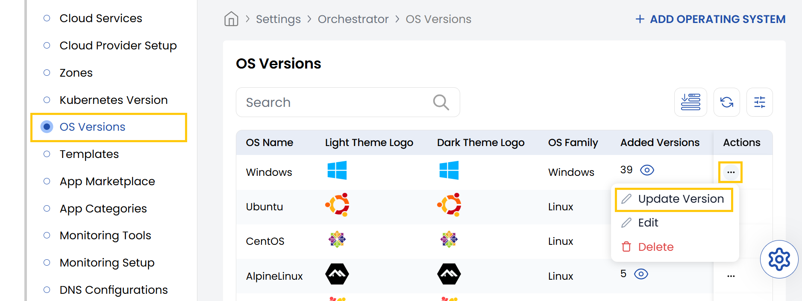
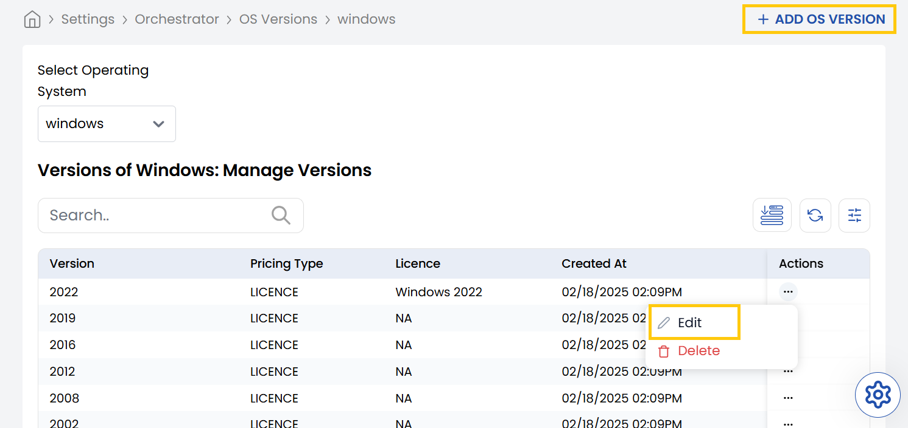
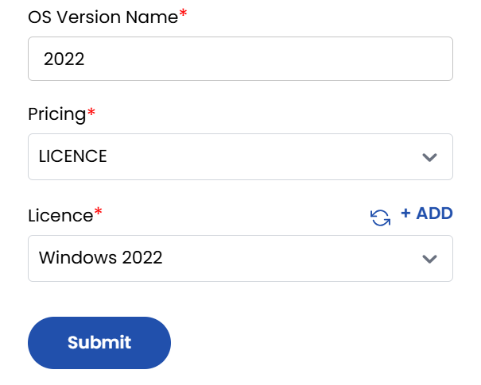

## License

The **Licenses** tab in the Stack Console allows administrators to configure how services are priced, billed, and contracted. Through this tab, you can set pricing schemes, enable service contracts, define billing cycles and cancellation terms, and offer free trials. Proper configuration ensures flexible licensing models that align with both business and customer needs.

- From the left-hand side of the page under the **Billing Setup** section, click on **License** to view the list of licenses.
- To create a new license, click on **Add License**.

- **Name:** Enter the name of the license.
- **Pricing Scheme:** Select the pricing model. Available option such as USAGE_BASED (billing is calculated based on usage metrics).
- **Enable Service Contract:** Check this option to activate service contract.

You need to enter billing details for license. Select the type of biling from Manual, Prepaid and Postpaid.  

- **Billing Cycles** – Define how often the user will be billed (e.g., Monthly, Yearly).
- **Billing Rules** – Set specific rules for invoicing and usage tracking.
- **Contract Status** – Choose the current status (e.g., Draft, Active).
- **Cancellation Deadline (Months)** – Define the number of months' notice required for cancellation.
- **Contract Discount** – Specify any discount (%) that applies to the contracted term.
- **Select Pricing Unit (Per):** Choose how the pricing is applied. Options include:
    - **Core** – Pricing based on number of CPU cores used.
    - **Account** – Pricing per account (flat fee per customer).
    - **Storage** – Pricing based on storage used (e.g., GB/TB).
    - **Instance** – Pricing per virtual machine or compute instance.

- **Enable Free Trial:** Check this option if you want to offer a trial period before billing begins.

## Add License Pricing to Rate Card

- To add or update license pricicing to a rate card from the left-hand side of the page under the **Billing Setup** section, click on **Rate Cards** to view the list of rate cards.
- Click on three dots besides rate card and select **Packages**. 

- Navigate to the licenses, click on three dots besides the license and select update price.

- To update the license pricing, first go to the **Licence Price Criteria** section. In the **Upto** and **To** fields, enter the core limit range (for example, from `0` to `2`). Then, input the fixed **Price** for that range (e.g., `200000`). Once you've filled in these details, click on **Add** to save the pricing rule.
- Next, go to the **Price after Last Price Criteria** section to configure pricing beyond the last specified range. In the **After** field, enter the final core limit from the previous section. Specify how many additional cores the price should apply to in the **For Unit(s)** field, and set the corresponding **Price**. Finally, click **Submit** to update and apply the new pricing settings.

## Attach License to OS Version

- From the left-hand side of the page under the **Orchestrator** section, click on **OS Versions** to view the list of different OS Versions. Click on three dots besides listed OS and select **Update Version**.

- You will see list of versions listed. Click on three dots besides listed OS versions and select **Edit** to edit license.
- Alternatively, you can create new OS version. Click on **Add OS Version**.

- Enter the OS version name, select the pricing type as **License** and select the the license you want to attach with the version. Click on **Submit**.

## Add Template with OS Version

----------

### Conclusion
The License section provides comprehensive control over service pricing and contracting models. For license configuration assistance, contact Stack Console support.