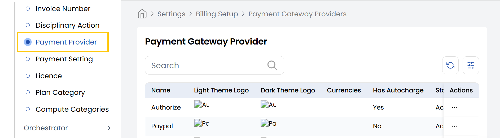

## Payment Gateway Provider

The **Payment Gateway Provider** tab allows administrators to view the integrated third-party payment providers (like PayPal, Stripe, etc.) within StackConsole. 

- From the left-hand side of the page under the **Billing Setup** section, click on **Payment Provider** to view the list of payment gateway providers.

----------
### Conclusion
The Payment Gateway Provider section displays all available integrated payment solutions in Stack Console.