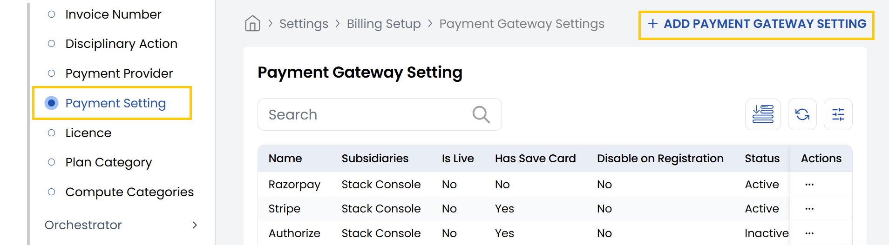
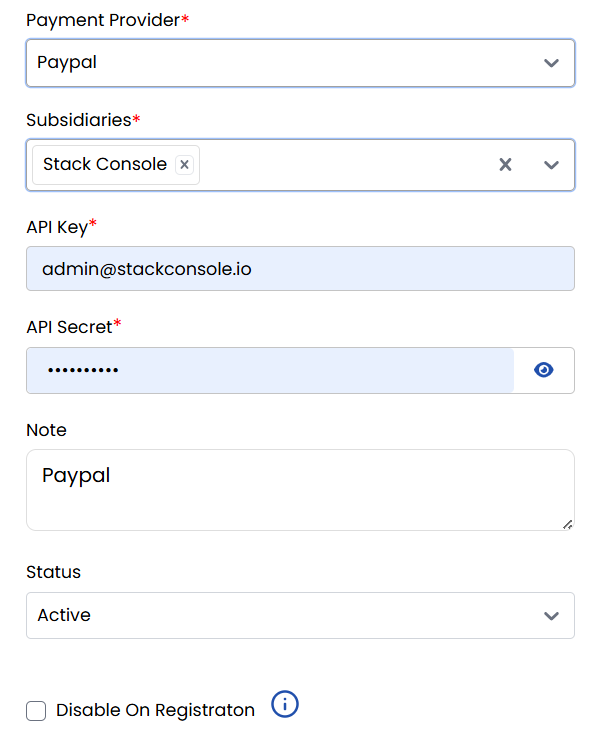
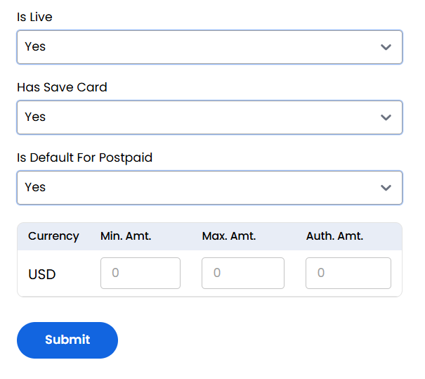

## Payment Gateway Settings

The **Payment Setting** tab allows administrators to integrate and configure third-party payment providers (like PayPal, Stripe, etc.) within StackConsole. This setup enables secure and automated handling of customer payments for services offered through the platform.

- From the left-hand side of the page under the **Billing Setup** section, click on **Payment Setting** to view the list of payment gateway providers.
- To create a new payment gateway, click on **Add Payment Gateway Setting**.

- **Payment Provider:** Select a provider (e.g., PayPal).
- **Subsidiaries:** Choose the relevant subsidiary.
- **API Key:** Enter the API Key.
- **API Secret:** Enter the secret/token.
- **Note (Optional):** Add internal remarks (e.g., "Primary PayPal gateway").
- **Status:** Set to Active or Inactive.
- **Disable On Registration:** This will prevent the payment gateway from being used during registration. 

- **Is Live:** Select Yes/No for live production.
- **Has Save Card:** Select Yes to allow card saving. 
- **Is Default For Postpaid:** Select Yes to make it default for postpaid customers.
- Add configuration for supported currencies (e.g., USD):
    - **Min. Amt.:** Enter minimum transaction amount.
    - **Max. Amt.:** Enter maximum transaction amount.
    - **Auth. Amt.:** Enter authorization hold amount.
- Click the **Submit** button to save the payment gateway settings for the provider.

----------

### Conclusion
The Payment Gateway Settings section provides complete control over payment processing integrations. For gateway configuration assistance, contact Stack Console support.