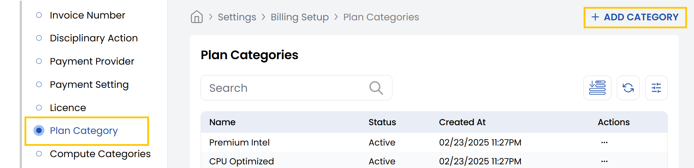
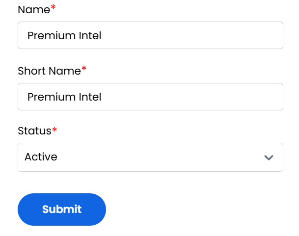

## Plan Category

The **Plan Category** tab in the Stack Console allows administrators to create structured groupings for different types of service plans. Whether the plans are categorized by performance type, user tiers, or features, this tab helps streamline how offerings are presented and managed within the platform.

- From the left-hand side of the page under the **Billing Setup** section, click on **Plan Category** to view the list of plan categories.
- To create a new plan category, click on **Add Category**.

- **Name:** Enter the full name of the category.
- **Short Name:** Provide an abbreviated version for system references or compact displays.
- **Status:** Choose Active/Inactive to enable/disable this plan category for use.
- Review the details you've entered. Click **Submit** to save and activate the plan category.

