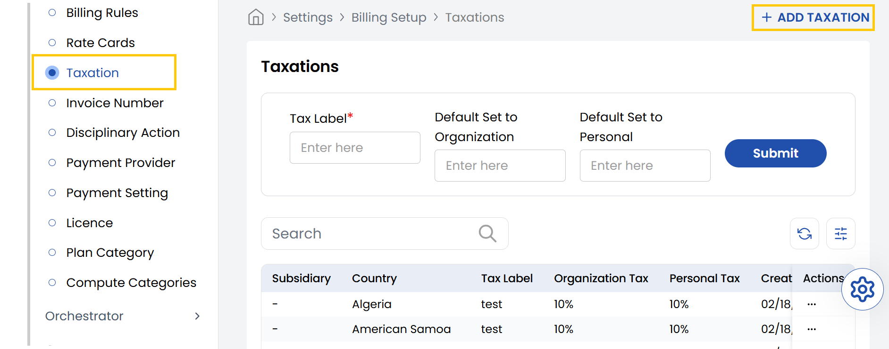
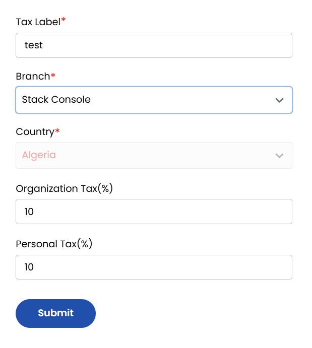

## Taxation

The **Taxation** tab in the Stack Console allows administrators to define tax rules at the branch and country level. By setting up both organization and personal tax rates, businesses can ensure compliant billing for different user types. This guide walks you through the steps to properly configure a new tax entry.

- From the left-hand side of the page under the **Billing Setup** section, click on **Taxations** to view the list of configurations for taxations.
- To create a new taxation configuration, click on **Add Taxation**.

- **Tax Label:** Provide a meaningful name for this tax entry (e.g., VAT India, GST Canada).
- **Branch:** Select the relevant branch this tax setting applies to.
- **Country:** Choose the country where this taxation rule will be enforced.
- **Organization Tax (%):** Enter the applicable tax rate for organizations.
- **Personal Tax (%):** Enter the applicable tax rate for individuals/personal accounts.
- Review the entered information for accuracy. Click **Submit** to save the taxation rule.

----------

### Conclusion
The Taxation section enables precise configuration of tax rules for compliant billing across different regions and user types. For taxation setup assistance, contact Stack Console support.