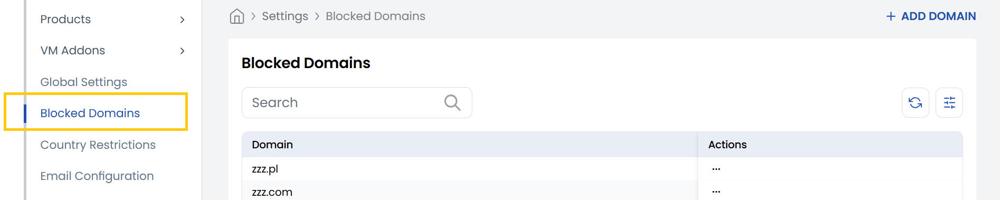

## Block Domains

The **Block Domain** tab allows admins to manage domain-level restrictions on the platform. It provides a list of all currently blocked domains, which helps prevent users from registering with unwanted or suspicious email domains (like temporary or spam services). Admins can easily add new domains to the blocklist, edit existing ones, or remove them as needed, offering full control over who gets access.

- To block a new domain, click on **Add Domain** located on the right-hand side of the page. Enter the domain name, and click **Submit**.

