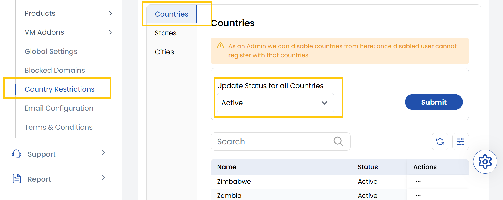
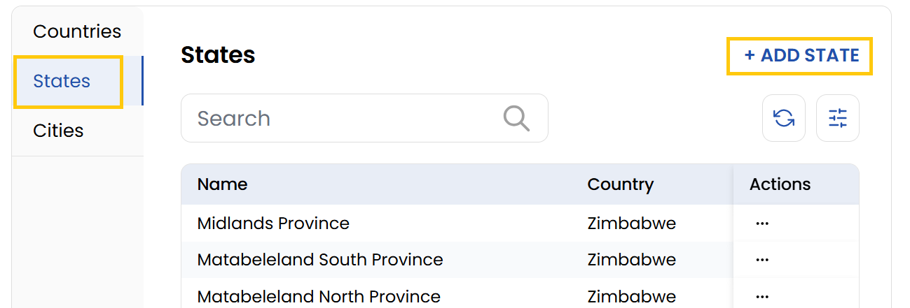
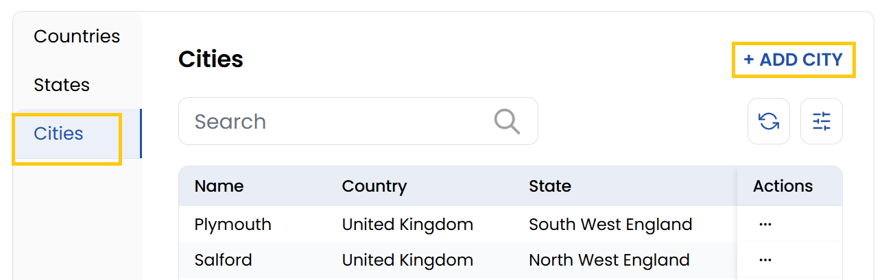

## Country Restrictions 

The **Country** tab enables you can view all supported countries and selectively disable any of them to restrict users from those regions from signing up. You can also toggle the active or inactive status of each country.

The **States** tab lets admins manage the list of states or provinces available within the system. It displays all existing states and provides an option to add new ones by selecting a country and entering the state name. 

- It displays all existing states and provides an option to add new ones by clicking on **Add State**. Select a country and entering the state name.

The **Cities** tab allows for detailed control over city-level access within the platform. Admins can view existing cities, disable specific ones, or add new cities to the restricted list. 

- To add a city click on **Add City**, just choose the country and state, and then enter the city name.

