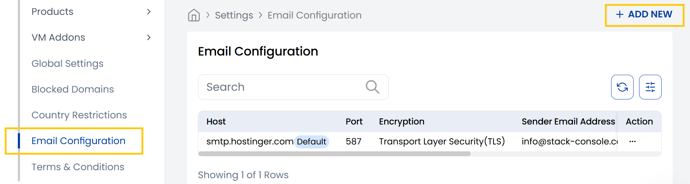
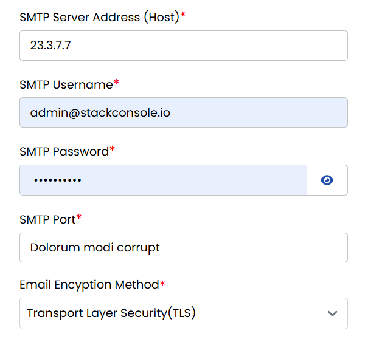
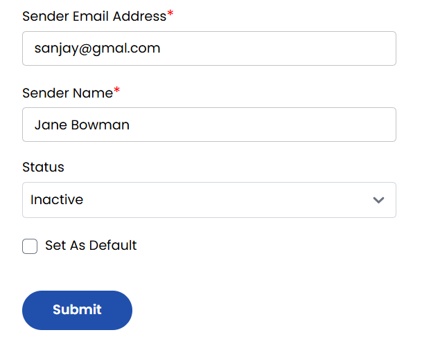

## Email Configuration

The **Email Configuration** tab in the Stack Console allows you to set up SMTP settings for sending system-generated emails such as alerts, notifications, and user communications. These settings define how emails are delivered from your platform using a secure and authenticated mail server.

-----

- From Settings section, navigate to **Email Configuration** to view the list of configurations. To add a new email configuration, click on **Add New** located on the right-hand side of the page. 

- **SMTP Server Address (Host):** IP or domain of the outgoing mail server.
- **SMTP Username:** Email or username used for server authentication.
- **SMTP Password:** Password for SMTP account (kept hidden).
- **SMTP Port:** Port number used for sending emails (e.g., 587 for TLS).
- **Email Encryption Method:** Security protocol used to encrypt outgoing emails (TLS/SSL).

- **Sender Email Address:** The email address shown as the sender in outgoing messages.
- **Sender Name:** The display name associated with the sender email.
- **Status:** Toggles whether this SMTP configuration is active or inactive.
- **Set As Default:** Marks this SMTP setup as the primary/default for the system.  
Click on **Submit** to save and apply the SMTP settings.

-----

## Conclusion

The **Email Configuration** tab is crucial for managing how your system communicates with users. Proper SMTP settings ensure reliable, authenticated, and secure email delivery across all your platform's messaging features.
